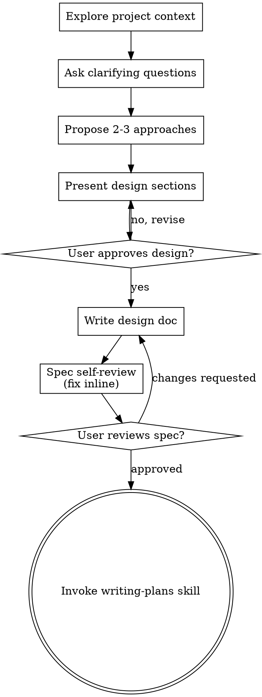

# Brainstorming Ideas Into Designs

Help turn ideas into fully formed designs and specs through natural collaborative dialogue.

Start by understanding the current project context, then ask questions one at a time to refine the idea. Once you understand what you're building, present the design and get user approval.

<HARD-GATE>
Do NOT invoke any implementation skill, write any code, scaffold any project, or take any implementation action until you have presented a design and the user has approved it. This applies to EVERY project regardless of perceived simplicity.
</HARD-GATE>

## Anti-Pattern: "This Is Too Simple To Need A Design"

Every project goes through this process. A todo list, a single-function utility, a config change — all of them. "Simple" projects are where unexamined assumptions cause the most wasted work. The design can be short (a few sentences for truly simple projects), but you MUST present it and get approval.

## Checklist

You MUST create a task for each of these items and complete them in order:

1. **Explore project context** — check files, docs, recent commits
2. **Offer the visual companion just-in-time** — NOT upfront. The first time a question would genuinely be clearer shown than described, offer it then (its own message); on approval its browser tab opens for you. If no visual question ever arises, never offer it. See the Visual Companion section below.
3. **Ask clarifying questions** — one at a time, understand purpose/constraints/success criteria
4. **Propose 2-3 approaches** — with trade-offs and your recommendation
5. **Present design** — in sections scaled to their complexity, get user approval after each section
6. **Write design doc** — save to `docs/superpowers/specs/YYYY-MM-DD-<topic>-design.md` and commit
7. **Spec self-review** — quick inline check for placeholders, contradictions, ambiguity, scope (see below)
8. **User reviews written spec** — ask user to review the spec file before proceeding
9. **Transition to implementation** — invoke writing-plans skill to create implementation plan

## Process Flow



**The terminal state is invoking writing-plans.** Do NOT invoke frontend-design, mcp-builder, or any other implementation skill. The ONLY skill you invoke after brainstorming is writing-plans.

## The Process

**Understanding the idea:**

- Check out the current project state first (files, docs, recent commits)
- Before asking detailed questions, assess scope: if the request describes multiple independent subsystems (e.g., "build a platform with chat, file storage, billing, and analytics"), flag this immediately. Don't spend questions refining details of a project that needs to be decomposed first.
- If the project is too large for a single spec, help the user decompose into sub-projects: what are the independent pieces, how do they relate, what order should they be built? Then brainstorm the first sub-project through the normal design flow. Each sub-project gets its own spec → plan → implementation cycle.
- For appropriately-scoped projects, ask questions one at a time to refine the idea
- Prefer multiple choice questions when possible, but open-ended is fine too
- Only one question per message - if a topic needs more exploration, break it into multiple questions
- Focus on understanding: purpose, constraints, success criteria

**Exploring approaches:**

- Propose 2-3 different approaches with trade-offs
- Present options conversationally with your recommendation and reasoning
- Lead with your recommended option and explain why

**Presenting the design:**

- Once you believe you understand what you're building, present the design
- Scale each section to its complexity: a few sentences if straightforward, up to 200-300 words if nuanced
- Ask after each section whether it looks right so far
- Cover: architecture, components, data flow, error handling, testing
- Be ready to go back and clarify if something doesn't make sense

**Design for isolation and clarity:**

- Break the system into smaller units that each have one clear purpose, communicate through well-defined interfaces, and can be understood and tested independently
- For each unit, you should be able to answer: what does it do, how do you use it, and what does it depend on?
- Can someone understand what a unit does without reading its internals? Can you change the internals without breaking consumers? If not, the boundaries need work.
- Smaller, well-bounded units are also easier for you to work with - you reason better about code you can hold in context at once, and your edits are more reliable when files are focused. When a file grows large, that's often a signal that it's doing too much.

**Working in existing codebases:**

- Explore the current structure before proposing changes. Follow existing patterns.
- Where existing code has problems that affect the work (e.g., a file that's grown too large, unclear boundaries, tangled responsibilities), include targeted improvements as part of the design - the way a good developer improves code they're working in.
- Don't propose unrelated refactoring. Stay focused on what serves the current goal.

## After the Design

**Documentation:**

- Write the validated design (spec) to `docs/superpowers/specs/YYYY-MM-DD-<topic>-design.md`
  - (User preferences for spec location override this default)
- Use elements-of-style:writing-clearly-and-concisely skill if available
- Commit the design document to git

**Spec Self-Review:**
After writing the spec document, look at it with fresh eyes:

1. **Placeholder scan:** Any "TBD", "TODO", incomplete sections, or vague requirements? Fix them.
2. **Internal consistency:** Do any sections contradict each other? Does the architecture match the feature descriptions?
3. **Scope check:** Is this focused enough for a single implementation plan, or does it need decomposition?
4. **Ambiguity check:** Could any requirement be interpreted two different ways? If so, pick one and make it explicit.

Fix any issues inline. No need to re-review — just fix and move on.

**User Review Gate:**
After the spec review loop passes, ask the user to review the written spec before proceeding:

> "Spec written and committed to `<path>`. Please review it and let me know if you want to make any changes before we start writing out the implementation plan."

Wait for the user's response. If they request changes, make them and re-run the spec review loop. Only proceed once the user approves.

**Implementation:**

- Invoke the writing-plans skill to create a detailed implementation plan
- Do NOT invoke any other skill. writing-plans is the next step.

## Key Principles

- **One question at a time** - Don't overwhelm with multiple questions
- **Multiple choice preferred** - Easier to answer than open-ended when possible
- **YAGNI ruthlessly** - Remove unnecessary features from all designs
- **Explore alternatives** - Always propose 2-3 approaches before settling
- **Incremental validation** - Present design, get approval before moving on
- **Be flexible** - Go back and clarify when something doesn't make sense

## Visual Companion

A browser-based companion for showing mockups, diagrams, and visual options during brainstorming. Available as a tool — not a mode. Accepting the companion means it's available for questions that benefit from visual treatment; it does NOT mean every question goes through the browser.

**Offering the companion (just-in-time):** Do NOT offer it upfront. Wait until a question would genuinely be clearer shown than told — a real mockup / layout / diagram question, not merely a UI *topic*. The first time that happens, offer it then, as its own message:
> "This next part might be easier if I show you — I can put together mockups, diagrams, and comparisons in a browser tab as we go. It's still new and can be token-intensive. Want me to? I'll open it for you."

**This offer MUST be its own message.** Only the offer — no clarifying question, summary, or other content. Wait for the user's response. If they accept, start the server with `--open` so their browser opens to the first screen automatically. If they decline, continue text-only and don't offer again unless they raise it.

**Per-question decision:** Even after the user accepts, decide FOR EACH QUESTION whether to use the browser or the terminal. The test: **would the user understand this better by seeing it than reading it?**

- **Use the browser** for content that IS visual — mockups, wireframes, layout comparisons, architecture diagrams, side-by-side visual designs
- **Use the terminal** for content that is text — requirements questions, conceptual choices, tradeoff lists, A/B/C/D text options, scope decisions

A question about a UI topic is not automatically a visual question. "What does personality mean in this context?" is a conceptual question — use the terminal. "Which wizard layout works better?" is a visual question — use the browser.

If they agree to the companion, read the detailed guide before proceeding:
`skills/brainstorming/visual-companion.md`


---

## Arquivo de apoio: `scripts/frame-template.html`

```html
<!DOCTYPE html>
<html>
<head>
  <meta charset="utf-8">
  <title>Superpowers Brainstorming</title>
  <style>
    /*
     * BRAINSTORM COMPANION FRAME TEMPLATE
     *
     * This template provides a consistent frame with:
     * - OS-aware light/dark theming
     * - Header branding and connection status
     * - Scrollable main content area
     * - CSS helpers for common UI patterns
     *
     * Content is injected via placeholder comment in #frame-content.
     */

    * { box-sizing: border-box; margin: 0; padding: 0; }
    html, body { height: 100%; overflow: hidden; }

    /* ===== THEME VARIABLES ===== */
    :root {
      --bg-primary: #f5f5f7;
      --bg-secondary: #ffffff;
      --bg-tertiary: #e5e5e7;
      --border: #d1d1d6;
      --text-primary: #1d1d1f;
      --text-secondary: #86868b;
      --text-tertiary: #aeaeb2;
      --accent: #0071e3;
      --accent-hover: #0077ed;
      --success: #34c759;
      --warning: #ff9f0a;
      --error: #ff3b30;
      --selected-bg: #e8f4fd;
      --selected-border: #0071e3;
    }

    @media (prefers-color-scheme: dark) {
      :root {
        --bg-primary: #1d1d1f;
        --bg-secondary: #2d2d2f;
        --bg-tertiary: #3d3d3f;
        --border: #424245;
        --text-primary: #f5f5f7;
        --text-secondary: #86868b;
        --text-tertiary: #636366;
        --accent: #0a84ff;
        --accent-hover: #409cff;
        --selected-bg: rgba(10, 132, 255, 0.15);
        --selected-border: #0a84ff;
      }
    }

    body {
      font-family: system-ui, -apple-system, BlinkMacSystemFont, sans-serif;
      background: var(--bg-primary);
      color: var(--text-primary);
      display: flex;
      flex-direction: column;
      line-height: 1.5;
    }

    /* ===== FRAME STRUCTURE ===== */
    .brand { display: flex; align-items: center; min-width: 0; overflow: hidden; color: var(--text-secondary); line-height: 1; }
    .brand a { color: inherit; text-decoration: none; display: flex; align-items: center; gap: 0.5rem; min-width: 0; max-width: 100%; line-height: 1; }
    .brand-copy { display: block; min-width: 0; overflow: hidden; text-overflow: ellipsis; white-space: nowrap; line-height: 1; transform: translateY(-1px); }
    .brand-logo { display: block; height: 1em; width: auto; max-width: 180px; flex-shrink: 0; filter: invert(1); }
    @media (prefers-color-scheme: dark) {
      .brand-logo { filter: none; }
    }
    .status { font-size: 0.7rem; color: var(--status-color, var(--success)); display: flex; align-items: center; gap: 0.4rem; justify-self: end; white-space: nowrap; line-height: 1; }
    .status::before { content: ''; width: 6px; height: 6px; background: var(--status-color, var(--success)); border-radius: 50%; }

    .main { flex: 1; overflow-y: auto; }
    #frame-content { padding: 2rem; min-height: 100%; }

    .header {
      background: var(--bg-secondary);
      border-bottom: 1px solid var(--border);
      padding: 0.5rem 1.5rem;
      flex-shrink: 0;
      display: grid;
      grid-template-columns: minmax(0, 1fr) auto;
      align-items: center;
      gap: 1rem;
      min-height: 42px;
    }
    .header .brand { justify-self: start; width: 100%; font-size: 0.75rem; line-height: 1; }
    .header .status { grid-column: 2; line-height: 1; }
    .header span {
      font-size: 0.75rem;
      color: var(--text-secondary);
    }
    .header .selected-text {
      color: var(--accent);
      font-weight: 500;
    }

    /* ===== TYPOGRAPHY ===== */
    h2 { font-size: 1.5rem; font-weight: 600; margin-bottom: 0.5rem; }
    h3 { font-size: 1.1rem; font-weight: 600; margin-bottom: 0.25rem; }
    .subtitle { color: var(--text-secondary); margin-bottom: 1.5rem; }
    .section { margin-bottom: 2rem; }
    .label { font-size: 0.7rem; color: var(--text-secondary); text-transform: uppercase; letter-spacing: 0.05em; margin-bottom: 0.5rem; }

    /* ===== OPTIONS (for A/B/C choices) ===== */
    .options { display: flex; flex-direction: column; gap: 0.75rem; }
    .option {
      background: var(--bg-secondary);
      border: 2px solid var(--border);
      border-radius: 12px;
      padding: 1rem 1.25rem;
      cursor: pointer;
      transition: all 0.15s ease;
      display: flex;
      align-items: flex-start;
      gap: 1rem;
    }
    .option:hover { border-color: var(--accent); }
    .option.selected { background: var(--selected-bg); border-color: var(--selected-border); }
    .option .letter {
      background: var(--bg-tertiary);
      color: var(--text-secondary);
      width: 1.75rem; height: 1.75rem;
      border-radius: 6px;
      display: flex; align-items: center; justify-content: center;
      font-weight: 600; font-size: 0.85rem; flex-shrink: 0;
    }
    .option.selected .letter { background: var(--accent); color: white; }
    .option .content { flex: 1; }
    .option .content h3 { font-size: 0.95rem; margin-bottom: 0.15rem; }
    .option .content p { color: var(--text-secondary); font-size: 0.85rem; margin: 0; }

    /* ===== CARDS (for showing designs/mockups) ===== */
    .cards { display: grid; grid-template-columns: repeat(auto-fit, minmax(280px, 1fr)); gap: 1rem; }
    .card {
      background: var(--bg-secondary);
      border: 1px solid var(--border);
      border-radius: 12px;
      overflow: hidden;
      cursor: pointer;
      transition: all 0.15s ease;
    }
    .card:hover { border-color: var(--accent); transform: translateY(-2px); box-shadow: 0 4px 12px rgba(0,0,0,0.1); }
    .card.selected { border-color: var(--selected-border); border-width: 2px; }
    .card-image { background: var(--bg-tertiary); aspect-ratio: 16/10; display: flex; align-items: center; justify-content: center; }
    .card-body { padding: 1rem; }
    .card-body h3 { margin-bottom: 0.25rem; }
    .card-body p { color: var(--text-secondary); font-size: 0.85rem; }

    /* ===== MOCKUP CONTAINER ===== */
    .mockup {
      background: var(--bg-secondary);
      border: 1px solid var(--border);
      border-radius: 12px;
      overflow: hidden;
      margin-bottom: 1.5rem;
    }
    .mockup-header {
      background: var(--bg-tertiary);
      padding: 0.5rem 1rem;
      font-size: 0.75rem;
      color: var(--text-secondary);
      border-bottom: 1px solid var(--border);
    }
    .mockup-body { padding: 1.5rem; }

    /* ===== SPLIT VIEW (side-by-side comparison) ===== */
    .split { display: grid; grid-template-columns: 1fr 1fr; gap: 1.5rem; }
    @media (max-width: 700px) { .split { grid-template-columns: 1fr; } }

    /* ===== PROS/CONS ===== */
    .pros-cons { display: grid; grid-template-columns: 1fr 1fr; gap: 1rem; margin: 1rem 0; }
    .pros, .cons { background: var(--bg-secondary); border-radius: 8px; padding: 1rem; }
    .pros h4 { color: var(--success); font-size: 0.85rem; margin-bottom: 0.5rem; }
    .cons h4 { color: var(--error); font-size: 0.85rem; margin-bottom: 0.5rem; }
    .pros ul, .cons ul { margin-left: 1.25rem; font-size: 0.85rem; color: var(--text-secondary); }
    .pros li, .cons li { margin-bottom: 0.25rem; }

    /* ===== PLACEHOLDER (for mockup areas) ===== */
    .placeholder {
      background: var(--bg-tertiary);
      border: 2px dashed var(--border);
      border-radius: 8px;
      padding: 2rem;
      text-align: center;
      color: var(--text-tertiary);
    }

    /* ===== INLINE MOCKUP ELEMENTS ===== */
    .mock-nav { background: var(--accent); color: white; padding: 0.75rem 1rem; display: flex; gap: 1.5rem; font-size: 0.9rem; }
    .mock-sidebar { background: var(--bg-tertiary); padding: 1rem; min-width: 180px; }
    .mock-content { padding: 1.5rem; flex: 1; }
    .mock-button { background: var(--accent); color: white; border: none; padding: 0.5rem 1rem; border-radius: 6px; font-size: 0.85rem; }
    .mock-input { background: var(--bg-primary); border: 1px solid var(--border); border-radius: 6px; padding: 0.5rem; width: 100%; }
  </style>
</head>
<body>
  <div class="header">
    <!-- BRANDING -->
    <div class="status">Connecting…</div>
  </div>

  <div class="main">
    <div id="frame-content">
      <!-- CONTENT -->
    </div>
  </div>

</body>
</html>
```


---

## Arquivo de apoio: `scripts/helper.js`

```javascript
(function() {
  const MIN_RECONNECT_MS = 500;
  const MAX_RECONNECT_MS = 30000;
  const TOMBSTONE_AFTER_MS = 15000; // show the "paused" overlay after this long disconnected

  // Pure: next backoff delay (doubles, capped). Exported for unit tests.
  function nextReconnectDelay(current, max) {
    return Math.min(current * 2, max);
  }
  if (typeof module !== 'undefined' && module.exports) {
    module.exports = { nextReconnectDelay, MIN_RECONNECT_MS, MAX_RECONNECT_MS, TOMBSTONE_AFTER_MS };
  }

  // Everything below is browser-only; bail out when loaded in Node (tests).
  if (typeof window === 'undefined') return;

  let ws = null;
  let eventQueue = [];
  let reconnectDelay = MIN_RECONNECT_MS;
  let reconnectTimer = null;
  let disconnectedSince = null;
  let everConnected = false;
  let tombstoneShown = false;

  function sessionKey() {
    try {
      return window.sessionStorage && window.sessionStorage.getItem('brainstorm-session-key');
    } catch (e) {}
    return null;
  }

  function websocketUrl() {
    const key = sessionKey();
    return 'ws://' + window.location.host + (key ? '/?key=' + encodeURIComponent(key) : '');
  }

  function reloadAfterRecovery() {
    const key = sessionKey();
    if (key) {
      window.location.replace('/?key=' + encodeURIComponent(key));
    } else {
      window.location.reload();
    }
  }

  // Reflect connection state in the frame's status pill (absent on full-doc screens).
  function setStatus(state) {
    const el = document.querySelector('.status');
    if (!el) return;
    const map = {
      connecting:   ['Connecting…',   'var(--text-tertiary)'],
      connected:    ['Connected',     'var(--success)'],
      reconnecting: ['Reconnecting…', 'var(--warning)'],
      disconnected: ['Disconnected',  'var(--error)']
    };
    const [text, color] = map[state] || map.disconnected;
    el.textContent = text;
    el.style.setProperty('--status-color', color);
  }

  // Self-styled so it works on framed and full-document screens alike.
  function showTombstone() {
    if (tombstoneShown) return;
    tombstoneShown = true;
    const el = document.createElement('div');
    el.id = 'bs-tombstone';
    el.style.cssText = 'position:fixed;inset:0;z-index:99999;display:flex;' +
      'align-items:center;justify-content:center;padding:2rem;text-align:center;' +
      'background:rgba(20,20,22,0.92);color:#f5f5f7;font-family:system-ui,sans-serif';
    el.innerHTML = '<div style="max-width:480px">' +
      '<h2 style="margin:0 0 .5rem;font-weight:600">Companion paused</h2>' +
      '<p style="margin:0;opacity:.85">This brainstorm companion has stopped. ' +
      'Ask your coding agent to bring it back — this page reconnects automatically.</p></div>';
    if (document.body) document.body.appendChild(el);
  }

  function connect() {
    if (reconnectTimer) { clearTimeout(reconnectTimer); reconnectTimer = null; }
    setStatus(everConnected ? 'reconnecting' : 'connecting');
    ws = new WebSocket(websocketUrl());

    ws.onopen = () => {
      const recovered = tombstoneShown;
      everConnected = true;
      disconnectedSince = null;
      reconnectDelay = MIN_RECONNECT_MS;
      tombstoneShown = false;
      setStatus('connected');
      eventQueue.forEach(e => ws.send(JSON.stringify(e)));
      eventQueue = [];
      // Recovered from a tombstoned outage (e.g. the server restarted on the same
      // port) — reload through the keyed bootstrap when possible so the cookie is
      // refreshed before the visible URL returns to bare /.
      if (recovered) reloadAfterRecovery();
    };

    ws.onmessage = (msg) => {
      let data;
      try { data = JSON.parse(msg.data); } catch (e) { return; }
      if (data.type === 'reload') window.location.reload();
    };

    ws.onclose = () => {
      ws = null;
      if (disconnectedSince === null) disconnectedSince = Date.now();
      if (Date.now() - disconnectedSince >= TOMBSTONE_AFTER_MS) {
        setStatus('disconnected');
        showTombstone();
      } else {
        setStatus('reconnecting');
      }
      reconnectTimer = setTimeout(connect, reconnectDelay);
      reconnectDelay = nextReconnectDelay(reconnectDelay, MAX_RECONNECT_MS);
    };

    // Let onclose own reconnection so we don't schedule it twice.
    ws.onerror = () => { try { ws.close(); } catch (e) {} };
  }

  function sendEvent(event) {
    event.timestamp = Date.now();
    if (ws && ws.readyState === WebSocket.OPEN) {
      ws.send(JSON.stringify(event));
    } else {
      eventQueue.push(event);
    }
  }

  // Capture clicks on choice elements
  document.addEventListener('click', (e) => {
    const target = e.target.closest('[data-choice]');
    if (!target) return;

    sendEvent({
      type: 'click',
      text: target.textContent.trim(),
      choice: target.dataset.choice,
      id: target.id || null
    });

  });

  // Frame UI: selection tracking
  window.selectedChoice = null;

  window.toggleSelect = function(el) {
    const container = el.closest('.options') || el.closest('.cards');
    const multi = container && container.dataset.multiselect !== undefined;
    if (container && !multi) {
      container.querySelectorAll('.option, .card').forEach(o => o.classList.remove('selected'));
    }
    if (multi) {
      el.classList.toggle('selected');
    } else {
      el.classList.add('selected');
    }
    window.selectedChoice = el.dataset.choice;
  };

  // Expose API for explicit use
  window.brainstorm = {
    send: sendEvent,
    choice: (value, metadata = {}) => sendEvent({ type: 'choice', value, ...metadata })
  };

  connect();
})();
```


---

## Arquivo de apoio: `scripts/server.cjs`

```javascript
const crypto = require('crypto');
const http = require('http');
const fs = require('fs');
const path = require('path');

// ========== WebSocket Protocol (RFC 6455) ==========

const OPCODES = { TEXT: 0x01, CLOSE: 0x08, PING: 0x09, PONG: 0x0A };
const WS_MAGIC = '258EAFA5-E914-47DA-95CA-C5AB0DC85B11';
const MAX_FRAME_PAYLOAD_BYTES = 10 * 1024 * 1024;

function computeAcceptKey(clientKey) {
  return crypto.createHash('sha1').update(clientKey + WS_MAGIC).digest('base64');
}

function encodeFrame(opcode, payload) {
  const fin = 0x80;
  const len = payload.length;
  let header;

  if (len < 126) {
    header = Buffer.alloc(2);
    header[0] = fin | opcode;
    header[1] = len;
  } else if (len < 65536) {
    header = Buffer.alloc(4);
    header[0] = fin | opcode;
    header[1] = 126;
    header.writeUInt16BE(len, 2);
  } else {
    header = Buffer.alloc(10);
    header[0] = fin | opcode;
    header[1] = 127;
    header.writeBigUInt64BE(BigInt(len), 2);
  }

  return Buffer.concat([header, payload]);
}

function decodeFrame(buffer) {
  if (buffer.length < 2) return null;

  const secondByte = buffer[1];
  const opcode = buffer[0] & 0x0F;
  const masked = (secondByte & 0x80) !== 0;
  let payloadLen = secondByte & 0x7F;
  let offset = 2;

  if (!masked) throw new Error('Client frames must be masked');

  if (payloadLen === 126) {
    if (buffer.length < 4) return null;
    payloadLen = buffer.readUInt16BE(2);
    offset = 4;
  } else if (payloadLen === 127) {
    if (buffer.length < 10) return null;
    const extendedLen = buffer.readBigUInt64BE(2);
    if (extendedLen > BigInt(MAX_FRAME_PAYLOAD_BYTES)) {
      throw new Error('WebSocket frame payload exceeds maximum allowed size');
    }
    payloadLen = Number(extendedLen);
    offset = 10;
  }

  if (payloadLen > MAX_FRAME_PAYLOAD_BYTES) {
    throw new Error('WebSocket frame payload exceeds maximum allowed size');
  }

  const maskOffset = offset;
  const dataOffset = offset + 4;
  const totalLen = dataOffset + payloadLen;
  if (buffer.length < totalLen) return null;

  const mask = buffer.slice(maskOffset, dataOffset);
  const data = Buffer.alloc(payloadLen);
  for (let i = 0; i < payloadLen; i++) {
    data[i] = buffer[dataOffset + i] ^ mask[i % 4];
  }

  return { opcode, payload: data, bytesConsumed: totalLen };
}

// ========== Configuration ==========

const PORT_FILE = process.env.BRAINSTORM_PORT_FILE || null;
const randomPort = () => 49152 + Math.floor(Math.random() * 16383);
// Prefer an explicit port, else the port this session last bound (so a restart
// reuses it and an already-open browser tab reconnects), else a random high port.
function preferredPort() {
  if (process.env.BRAINSTORM_PORT) return Number(process.env.BRAINSTORM_PORT);
  if (PORT_FILE) {
    try {
      const p = Number(fs.readFileSync(PORT_FILE, 'utf-8').trim());
      if (Number.isInteger(p) && p > 1023 && p < 65536) return p;
    } catch (e) { /* no prior port recorded */ }
  }
  return randomPort();
}
let PORT = preferredPort();
const HOST = process.env.BRAINSTORM_HOST || '127.0.0.1';
const URL_HOST = process.env.BRAINSTORM_URL_HOST || (HOST === '127.0.0.1' ? 'localhost' : HOST);
const SESSION_DIR = process.env.BRAINSTORM_DIR || '/tmp/brainstorm';
const CONTENT_DIR = path.join(SESSION_DIR, 'content');
const STATE_DIR = path.join(SESSION_DIR, 'state');
const SUPERPOWERS_VERSION = readSuperpowersVersion();
const SUPERPOWERS_BRAND_IMAGE_URL = 'https://primeradiant.com/brand/superpowers-visual-brainstorming-logo.png';
const TELEMETRY_DISABLE_ENV_VARS = [
  'SUPERPOWERS_DISABLE_TELEMETRY',
  'DISABLE_TELEMETRY',
  'CLAUDE_CODE_DISABLE_NONESSENTIAL_TRAFFIC'
];
const SUPERPOWERS_TELEMETRY_DISABLED = TELEMETRY_DISABLE_ENV_VARS.some(name => isTruthyEnv(process.env[name]));
let ownerPid = process.env.BRAINSTORM_OWNER_PID ? Number(process.env.BRAINSTORM_OWNER_PID) : null;

// Per-session secret key. The companion is reachable by any local browser tab
// and, when bound to a non-loopback host, by any host that can route to it.
// The key authenticates the real client uniformly across loopback, tunnel, and
// remote binds — and defeats DNS rebinding — where a Host/Origin allowlist
// cannot. It rides the served URL as ?key= and is mirrored into a cookie on
// first load so same-origin subresources and the WebSocket carry it for free.
// Persisted alongside the port (BRAINSTORM_TOKEN_FILE) so a restart keeps the
// same key and an already-open tab's cookie still validates.
const TOKEN_FILE = process.env.BRAINSTORM_TOKEN_FILE || null;
function generateToken() {
  return crypto.randomBytes(32).toString('hex');
}

function chmodOwnerOnly(file) {
  try { fs.chmodSync(file, 0o600); } catch (e) { /* best effort */ }
}

function initialToken() {
  if (process.env.BRAINSTORM_TOKEN) {
    return { value: process.env.BRAINSTORM_TOKEN, source: 'env' };
  }
  if (TOKEN_FILE) {
    try {
      const t = fs.readFileSync(TOKEN_FILE, 'utf-8').trim();
      if (/^[0-9a-f]{32,}$/i.test(t)) {
        chmodOwnerOnly(TOKEN_FILE);
        return { value: t, source: 'file' };
      }
    } catch (e) { /* no prior token recorded */ }
  }
  return { value: generateToken(), source: 'generated' };
}

const tokenInfo = initialToken();
let TOKEN = tokenInfo.value;
let tokenSource = tokenInfo.source;
let COOKIE_NAME = 'brainstorm-key-' + PORT; // refined to the actual bound port in onListen

const MIME_TYPES = {
  '.html': 'text/html', '.css': 'text/css', '.js': 'application/javascript',
  '.json': 'application/json', '.png': 'image/png', '.jpg': 'image/jpeg',
  '.jpeg': 'image/jpeg', '.gif': 'image/gif', '.svg': 'image/svg+xml'
};

// ========== Templates and Constants ==========

function waitingPage() {
  return renderBranding(`<!DOCTYPE html>
<html>
<head><meta charset="utf-8"><title>Brainstorm Companion</title>
<style>
body { font-family: system-ui, sans-serif; padding: 2rem; max-width: 800px; margin: 0 auto; }
h1 { color: #333; } p { color: #666; }
.brand { display: flex; align-items: center; min-width: 0; overflow: hidden; margin-bottom: 1.5rem; color: #666; font-size: 0.9rem; line-height: 1; }
.brand a { color: inherit; text-decoration: none; display: flex; align-items: center; gap: 0.5rem; min-width: 0; max-width: 100%; line-height: 1; }
.brand-copy { display: block; min-width: 0; overflow: hidden; text-overflow: ellipsis; white-space: nowrap; line-height: 1; transform: translateY(-1px); }
.brand-logo { display: block; height: 1em; width: auto; max-width: 180px; filter: invert(1); }
</style>
</head>
<body><!-- BRANDING --><h1>Brainstorm Companion</h1>
<p>Waiting for the agent to push a screen...</p></body></html>`);
}

const FORBIDDEN_PAGE = `<!DOCTYPE html>
<html>
<head><meta charset="utf-8"><title>Session key required</title>
<style>body { font-family: system-ui, sans-serif; padding: 2rem; max-width: 800px; margin: 0 auto; }
h1 { color: #333; } p { color: #666; } code { background: #f0f0f0; padding: 0.1em 0.3em; border-radius: 4px; }</style>
</head>
<body><h1>Session key required</h1>
<p>This page needs the full URL your coding agent gave you, including the
<code>?key=&hellip;</code> part. Copy the complete URL and open it again.</p></body></html>`;

function bootstrapPage(key) {
  const jsonKey = JSON.stringify(String(key));
  return `<!DOCTYPE html>
<html>
<head><meta charset="utf-8"><title>Opening Brainstorm Companion</title></head>
<body>
<script>
try { sessionStorage.setItem('brainstorm-session-key', ${jsonKey}); } catch (e) {}
location.replace('/');
</script>
</body>
</html>`;
}

const frameTemplate = fs.readFileSync(path.join(__dirname, 'frame-template.html'), 'utf-8');
const helperScript = fs.readFileSync(path.join(__dirname, 'helper.js'), 'utf-8');
const helperInjection = '<script>\n' + helperScript + '\n</script>';

// ========== Helper Functions ==========

function readSuperpowersVersion() {
  const root = path.join(__dirname, '../../..');
  const manifests = [
    path.join(root, 'package.json'),
    path.join(root, '.codex-plugin/plugin.json')
  ];

  for (const manifest of manifests) {
    try {
      const data = JSON.parse(fs.readFileSync(manifest, 'utf-8'));
      if (data.version) return String(data.version);
    } catch (e) {
      // Packaged Codex plugins omit package.json; try the next manifest.
    }
  }

  return 'unknown';
}

function isTruthyEnv(value) {
  if (!value) return false;
  const normalized = String(value).trim().toLowerCase();
  if (!normalized) return false;
  return !['0', 'false', 'no', 'off'].includes(normalized);
}

function escapeHtmlText(value) {
  return String(value)
    .replace(/&/g, '&amp;')
    .replace(/</g, '&lt;')
    .replace(/>/g, '&gt;')
    .replace(/"/g, '&quot;');
}

function brandMarkup() {
  const version = escapeHtmlText(SUPERPOWERS_VERSION);
  const text = SUPERPOWERS_TELEMETRY_DISABLED
    ? 'Prime Radiant Superpowers v' + version
    : 'Superpowers v' + version;
  const logo = SUPERPOWERS_TELEMETRY_DISABLED
    ? ''
    : '';

  return '<div class="brand"><a href="https://github.com/obra/superpowers">' + logo + '<span class="brand-copy">' + text + '</span></a></div>';
}

function renderBranding(html) {
  return html.split('<!-- BRANDING -->').join(brandMarkup());
}

function isFullDocument(html) {
  const trimmed = html.trimStart().toLowerCase();
  return trimmed.startsWith('<!doctype') || trimmed.startsWith('<html');
}

function wrapInFrame(content) {
  return renderBranding(frameTemplate).replace('<!-- CONTENT -->', content);
}

function getNewestScreen() {
  const files = fs.readdirSync(CONTENT_DIR)
    .filter(f => !f.startsWith('.') && f.endsWith('.html'))
    .map(f => {
      const fp = path.join(CONTENT_DIR, f);
      if (!isRegularFileInsideContentDir(fp)) return null;
      return { path: fp, mtime: fs.statSync(fp).mtime.getTime() };
    })
    .filter(Boolean)
    .sort((a, b) => b.mtime - a.mtime);
  return files.length > 0 ? files[0].path : null;
}

function urlHostForHttp(host) {
  const h = String(host);
  if (h.startsWith('[') && h.endsWith(']')) return h;
  return h.includes(':') ? '[' + h + ']' : h;
}

function companionUrl() {
  return 'http://' + urlHostForHttp(URL_HOST) + ':' + PORT + '/?key=' + TOKEN;
}

function browserLauncherForPlatform(url, {
  platform = process.platform,
  osRelease = require('os').release(),
  env = process.env
} = {}) {
  const isWSL = platform === 'linux' && /microsoft/i.test(osRelease);
  if (platform === 'darwin') return { bin: 'open', args: [url] };
  if (platform === 'win32' || isWSL) {
    return { bin: 'rundll32.exe', args: ['url.dll,FileProtocolHandler', url] };
  }
  if (env.DISPLAY || env.WAYLAND_DISPLAY) return { bin: 'xdg-open', args: [url] };
  return null;
}

function isRegularFileInsideContentDir(filePath) {
  let stat, realContentDir, realFilePath;
  try {
    stat = fs.lstatSync(filePath);
    if (stat.isSymbolicLink()) return false;
    if (!stat.isFile()) return false;
    if (stat.nlink !== 1) return false;
    realContentDir = fs.realpathSync(CONTENT_DIR);
    realFilePath = fs.realpathSync(filePath);
  } catch (e) {
    return false;
  }
  return realFilePath.startsWith(realContentDir + path.sep);
}

// ========== Authentication ==========

function timingSafeEqualStr(a, b) {
  const ab = Buffer.from(String(a));
  const bb = Buffer.from(String(b));
  if (ab.length !== bb.length) return false;
  return crypto.timingSafeEqual(ab, bb);
}

function parseCookies(header) {
  const out = {};
  if (!header) return out;
  for (const part of header.split(';')) {
    const eq = part.indexOf('=');
    if (eq < 0) continue;
    out[part.slice(0, eq).trim()] = part.slice(eq + 1).trim();
  }
  return out;
}

// A request is authorized if it carries the session key as ?key= or as the
// session cookie. Both are compared in constant time.
function isAuthorized(req) {
  const q = req.url.indexOf('?');
  if (q >= 0) {
    const params = new URLSearchParams(req.url.slice(q + 1));
    if (params.has('key')) {
      const key = params.get('key');
      return Boolean(key && timingSafeEqualStr(key, TOKEN));
    }
  }
  const cookie = parseCookies(req.headers['cookie'])[COOKIE_NAME];
  if (cookie && timingSafeEqualStr(cookie, TOKEN)) return true;
  return false;
}

function pathnameOf(url) {
  const q = url.indexOf('?');
  return q >= 0 ? url.slice(0, q) : url;
}

function queryKey(url) {
  const q = url.indexOf('?');
  if (q < 0) return null;
  return new URLSearchParams(url.slice(q + 1)).get('key');
}

function securityHeaders(headers = {}) {
  return {
    'Referrer-Policy': 'no-referrer',
    'Cache-Control': 'no-store',
    'X-Frame-Options': 'DENY',
    'Content-Security-Policy': "frame-ancestors 'none'",
    'Cross-Origin-Resource-Policy': 'same-origin',
    ...headers
  };
}

function isAllowedWebSocketOrigin(req) {
  const origin = req.headers.origin;
  if (!origin) return true;
  const host = req.headers.host;
  if (!host) return false;
  return origin === 'http://' + host;
}

// ========== HTTP Request Handler ==========

function handleRequest(req, res) {
  if (!isAuthorized(req)) {
    res.writeHead(403, securityHeaders({ 'Content-Type': 'text/html; charset=utf-8' }));
    res.end(FORBIDDEN_PAGE);
    return;
  }
  touchActivity(); // only authorized requests count as activity

  // Mirror the key into a cookie so same-origin subresources (/files/*) can
  // authenticate after bootstrap. HttpOnly keeps it away from page scripts; the
  // WebSocket Origin check below is what blocks cross-origin localhost injection.
  res.setHeader('Set-Cookie',
    COOKIE_NAME + '=' + TOKEN + '; HttpOnly; SameSite=Strict; Path=/');

  const pathname = pathnameOf(req.url);
  const keyFromQuery = queryKey(req.url);
  if (req.method === 'GET' && pathname === '/' && keyFromQuery && timingSafeEqualStr(keyFromQuery, TOKEN)) {
    res.writeHead(200, securityHeaders({ 'Content-Type': 'text/html; charset=utf-8' }));
    res.end(bootstrapPage(keyFromQuery));
  } else if (req.method === 'GET' && pathname === '/') {
    const screenFile = getNewestScreen();
    let html = screenFile
      ? (raw => isFullDocument(raw) ? raw : wrapInFrame(raw))(fs.readFileSync(screenFile, 'utf-8'))
      : waitingPage();

    if (html.includes('</body>')) {
      html = html.replace('</body>', helperInjection + '\n</body>');
    } else {
      html += helperInjection;
    }

    res.writeHead(200, securityHeaders({ 'Content-Type': 'text/html; charset=utf-8' }));
    res.end(html);
  } else if (req.method === 'GET' && pathname.startsWith('/files/')) {
    const fileName = path.basename(pathname.slice(7));
    const filePath = path.join(CONTENT_DIR, fileName);
    // Reject empty/dotfile names and anything that isn't a regular file —
    // `/files/` would otherwise resolve to CONTENT_DIR and crash readFileSync (EISDIR).
    if (!fileName || fileName.startsWith('.') || !isRegularFileInsideContentDir(filePath)) {
      res.writeHead(404, securityHeaders());
      res.end('Not found');
      return;
    }
    const ext = path.extname(filePath).toLowerCase();
    const contentType = MIME_TYPES[ext] || 'application/octet-stream';
    res.writeHead(200, securityHeaders({ 'Content-Type': contentType }));
    res.end(fs.readFileSync(filePath));
  } else {
    res.writeHead(404, securityHeaders());
    res.end('Not found');
  }
}

// ========== WebSocket Connection Handling ==========

const clients = new Set();

function handleUpgrade(req, socket) {
  if (!isAuthorized(req) || !isAllowedWebSocketOrigin(req)) { socket.destroy(); return; }

  const key = req.headers['sec-websocket-key'];
  if (!key) { socket.destroy(); return; }

  const accept = computeAcceptKey(key);
  socket.write(
    'HTTP/1.1 101 Switching Protocols\r\n' +
    'Upgrade: websocket\r\n' +
    'Connection: Upgrade\r\n' +
    'Sec-WebSocket-Accept: ' + accept + '\r\n\r\n'
  );

  let buffer = Buffer.alloc(0);
  clients.add(socket);

  socket.on('data', (chunk) => {
    buffer = Buffer.concat([buffer, chunk]);
    while (buffer.length > 0) {
      let result;
      try {
        result = decodeFrame(buffer);
      } catch (e) {
        socket.end(encodeFrame(OPCODES.CLOSE, Buffer.alloc(0)));
        clients.delete(socket);
        return;
      }
      if (!result) break;
      buffer = buffer.slice(result.bytesConsumed);

      switch (result.opcode) {
        case OPCODES.TEXT:
          handleMessage(result.payload.toString());
          break;
        case OPCODES.CLOSE:
          socket.end(encodeFrame(OPCODES.CLOSE, Buffer.alloc(0)));
          clients.delete(socket);
          return;
        case OPCODES.PING:
          socket.write(encodeFrame(OPCODES.PONG, result.payload));
          break;
        case OPCODES.PONG:
          break;
        default: {
          const closeBuf = Buffer.alloc(2);
          closeBuf.writeUInt16BE(1003);
          socket.end(encodeFrame(OPCODES.CLOSE, closeBuf));
          clients.delete(socket);
          return;
        }
      }
    }
  });

  socket.on('close', () => clients.delete(socket));
  socket.on('error', () => clients.delete(socket));
}

function handleMessage(text) {
  let event;
  try {
    event = JSON.parse(text);
  } catch (e) {
    console.error('Failed to parse WebSocket message:', e.message);
    return;
  }
  touchActivity();
  console.log(JSON.stringify({ source: 'user-event', ...event }));
  if (event && event.choice) {
    const eventsFile = path.join(STATE_DIR, 'events');
    fs.appendFileSync(eventsFile, JSON.stringify(event) + '\n');
  }
}

function broadcast(msg) {
  const frame = encodeFrame(OPCODES.TEXT, Buffer.from(JSON.stringify(msg)));
  for (const socket of clients) {
    try { socket.write(frame); } catch (e) { clients.delete(socket); }
  }
}

// Best-effort: open the user's browser the first time a screen is actually ready
// to show. Skips when disabled, on a non-loopback (remote) bind, or when a
// browser is already connected. Override the launcher with BRAINSTORM_OPEN_CMD.
let browserOpened = false;
function maybeOpenBrowser() {
  if (browserOpened) return;
  browserOpened = true;
  if (!process.env.BRAINSTORM_OPEN) return; // opt-in: only after the user approves the companion
  if (HOST !== '127.0.0.1' && HOST !== 'localhost') return;
  if (clients.size > 0) return; // the user already opened it
  const url = companionUrl(); // must carry the key or the gate 403s it
  const cp = require('child_process');
  // Operator-provided launcher: run as given (this env var is trusted operator input).
  if (process.env.BRAINSTORM_OPEN_CMD) {
    try { cp.exec(process.env.BRAINSTORM_OPEN_CMD + ' ' + JSON.stringify(url), () => {}); } catch (e) { /* best effort */ }
    return;
  }
  // Platform launchers: pass the URL as an argv element via execFile (no shell),
  // so a url-host containing shell metacharacters can't inject a command.
  const launcher = browserLauncherForPlatform(url);
  if (!launcher) return; // headless: nothing to open
  try { cp.execFile(launcher.bin, launcher.args, () => {}); } catch (e) { /* best effort */ }
}

// ========== Activity Tracking ==========

// Idle timeout: shut down after this long with no activity. Default 4 hours;
// override with BRAINSTORM_IDLE_TIMEOUT_MS (start-server.sh: --idle-timeout-minutes).
const IDLE_TIMEOUT_MS = (() => {
  const ms = Number(process.env.BRAINSTORM_IDLE_TIMEOUT_MS);
  return Number.isFinite(ms) && ms > 0 ? ms : 4 * 60 * 60 * 1000;
})();
// How often the watchdog checks for owner-death / idleness. Configurable mainly
// so tests can run fast; production default is 60s.
const LIFECYCLE_CHECK_MS = (() => {
  const ms = Number(process.env.BRAINSTORM_LIFECYCLE_CHECK_MS);
  return Number.isFinite(ms) && ms > 0 ? ms : 60 * 1000;
})();
let lastActivity = Date.now();

function touchActivity() {
  lastActivity = Date.now();
}

// ========== File Watching ==========

const debounceTimers = new Map();

// ========== Server Startup ==========

function startServer() {
  if (!fs.existsSync(CONTENT_DIR)) fs.mkdirSync(CONTENT_DIR, { recursive: true });
  if (!fs.existsSync(STATE_DIR)) fs.mkdirSync(STATE_DIR, { recursive: true });

  // Track known files to distinguish new screens from updates.
  // macOS fs.watch reports 'rename' for both new files and overwrites,
  // so we can't rely on eventType alone.
  const knownFiles = new Set(
    fs.readdirSync(CONTENT_DIR).filter(f => !f.startsWith('.') && f.endsWith('.html'))
  );

  const server = http.createServer(handleRequest);
  server.on('upgrade', handleUpgrade);

  const watcher = fs.watch(CONTENT_DIR, (eventType, filename) => {
    if (!filename || filename.startsWith('.') || !filename.endsWith('.html')) return;

    if (debounceTimers.has(filename)) clearTimeout(debounceTimers.get(filename));
    debounceTimers.set(filename, setTimeout(() => {
      debounceTimers.delete(filename);
      const filePath = path.join(CONTENT_DIR, filename);

      if (!fs.existsSync(filePath)) return; // file was deleted
      touchActivity();

      if (!knownFiles.has(filename)) {
        knownFiles.add(filename);
        const eventsFile = path.join(STATE_DIR, 'events');
        if (fs.existsSync(eventsFile)) fs.unlinkSync(eventsFile);
        console.log(JSON.stringify({ type: 'screen-added', file: filePath }));
        maybeOpenBrowser();
      } else {
        console.log(JSON.stringify({ type: 'screen-updated', file: filePath }));
      }

      broadcast({ type: 'reload' });
    }, 100));
  });
  watcher.on('error', (err) => console.error('fs.watch error:', err.message));

  function shutdown(reason) {
    console.log(JSON.stringify({ type: 'server-stopped', reason }));
    const infoFile = path.join(STATE_DIR, 'server-info');
    if (fs.existsSync(infoFile)) fs.unlinkSync(infoFile);
    fs.writeFileSync(
      path.join(STATE_DIR, 'server-stopped'),
      JSON.stringify({ reason, timestamp: Date.now() }) + '\n'
    );
    watcher.close();
    clearInterval(lifecycleCheck);
    // Close any upgraded WebSocket sockets so server.close() can complete and
    // the process actually exits instead of lingering on an open connection.
    for (const socket of clients) {
      try { socket.destroy(); } catch (e) { /* already gone */ }
    }
    server.close(() => process.exit(0));
  }

  function ownerAlive() {
    if (!ownerPid) return true;
    try { process.kill(ownerPid, 0); return true; } catch (e) { return e.code === 'EPERM'; }
  }

  // Periodically exit if the owner process died or we've been idle too long.
  const lifecycleCheck = setInterval(() => {
    if (!ownerAlive()) shutdown('owner process exited');
    else if (Date.now() - lastActivity > IDLE_TIMEOUT_MS) shutdown('idle timeout');
  }, LIFECYCLE_CHECK_MS);
  lifecycleCheck.unref();

  // Validate owner PID at startup. If it's already dead, the PID resolution
  // was wrong (common on WSL, Tailscale SSH, and cross-user scenarios).
  // Disable monitoring and rely on the idle timeout instead.
  if (ownerPid) {
    try { process.kill(ownerPid, 0); }
    catch (e) {
      if (e.code !== 'EPERM') {
        console.log(JSON.stringify({ type: 'owner-pid-invalid', pid: ownerPid, reason: 'dead at startup' }));
        ownerPid = null;
      }
    }
  }

  // If the preferred port is already taken (e.g. a previous server is still
  // alive), fall back to a random port once instead of failing.
  let triedFallback = false;

  function onListen() {
    // Cookie name keys on the ACTUAL bound port (may differ from the preferred
    // one after an EADDRINUSE fallback) so it can't collide with another server's
    // cookie in the shared localhost jar.
    COOKIE_NAME = 'brainstorm-key-' + PORT;
    // Record the bound port AND token so the next restart of this session reuses
    // them — but ONLY when we got our preferred port. On a fallback we bound a
    // *different* port because someone else holds the preferred one; persisting
    // would overwrite the shared files and strand that other session's open tab.
    if (PORT_FILE && !triedFallback) {
      try { fs.writeFileSync(PORT_FILE, String(PORT)); } catch (e) { /* best effort */ }
      if (TOKEN_FILE) {
        try {
          fs.writeFileSync(TOKEN_FILE, TOKEN, { mode: 0o600 });
          chmodOwnerOnly(TOKEN_FILE);
        } catch (e) { /* best effort */ }
      }
    }
    const info = JSON.stringify({
      type: 'server-started', port: Number(PORT), host: HOST,
      url_host: URL_HOST, url: companionUrl(),
      screen_dir: CONTENT_DIR, state_dir: STATE_DIR, idle_timeout_ms: IDLE_TIMEOUT_MS
    });
    console.log(info);
    // server-info embeds the key — keep it owner-only.
    fs.writeFileSync(path.join(STATE_DIR, 'server-info'), info + '\n', { mode: 0o600 });
  }

  server.on('error', (err) => {
    if (err.code === 'EADDRINUSE' && !triedFallback) {
      if (tokenSource === 'env') {
        console.error('Server failed to bind: preferred port is in use and BRAINSTORM_TOKEN is set; refusing fallback with explicit token');
        process.exit(1);
      }
      triedFallback = true;
      PORT = randomPort();
      if (tokenSource === 'file') {
        TOKEN = generateToken();
        tokenSource = 'generated-fallback';
      }
      server.listen(PORT, HOST, onListen);
    } else {
      console.error('Server failed to bind:', err.message);
      process.exit(1);
    }
  });
  server.listen(PORT, HOST, onListen);
}

if (require.main === module) {
  startServer();
}

module.exports = {
  computeAcceptKey,
  encodeFrame,
  decodeFrame,
  browserLauncherForPlatform,
  OPCODES,
  MAX_FRAME_PAYLOAD_BYTES
};
```


---

## Arquivo de apoio: `scripts/start-server.sh`

```bash
#!/usr/bin/env bash
# Start the brainstorm server and output connection info
# Usage: start-server.sh [--project-dir <path>] [--host <bind-host>] [--url-host <display-host>] [--foreground] [--background]
#
# Starts server on a random high port, outputs JSON with URL.
# Each session gets its own directory to avoid conflicts.
#
# Options:
#   --project-dir <path>  Store session files under <path>/.superpowers/brainstorm/
#                         instead of /tmp. Files persist after server stops.
#   --host <bind-host>    Host/interface to bind (default: 127.0.0.1).
#                         Use 0.0.0.0 in remote/containerized environments.
#   --url-host <host>     Hostname shown in returned URL JSON.
#   --idle-timeout-minutes <n>  Shut down after n minutes idle (default 240 = 4h).
#   --open                Auto-open the browser on the first screen (use only
#                         after the user approves the visual companion).
#   --foreground          Run server in the current terminal (no backgrounding).
#   --background          Force background mode (overrides Codex auto-foreground).

SCRIPT_DIR="$(cd "$(dirname "$0")" && pwd)"

# Parse arguments
PROJECT_DIR=""
FOREGROUND="false"
FORCE_BACKGROUND="false"
BIND_HOST="127.0.0.1"
URL_HOST=""
IDLE_TIMEOUT_MINUTES=""
while [[ $# -gt 0 ]]; do
  case "$1" in
    --project-dir)
      PROJECT_DIR="$2"
      shift 2
      ;;
    --host)
      BIND_HOST="$2"
      shift 2
      ;;
    --url-host)
      URL_HOST="$2"
      shift 2
      ;;
    --idle-timeout-minutes)
      IDLE_TIMEOUT_MINUTES="$2"
      shift 2
      ;;
    --open)
      export BRAINSTORM_OPEN=1
      shift
      ;;
    --foreground|--no-daemon)
      FOREGROUND="true"
      shift
      ;;
    --background|--daemon)
      FORCE_BACKGROUND="true"
      shift
      ;;
    *)
      echo "{\"error\": \"Unknown argument: $1\"}"
      exit 1
      ;;
  esac
done

if [[ -z "$URL_HOST" ]]; then
  if [[ "$BIND_HOST" == "127.0.0.1" || "$BIND_HOST" == "localhost" ]]; then
    URL_HOST="localhost"
  else
    URL_HOST="$BIND_HOST"
  fi
fi

if [[ -n "$IDLE_TIMEOUT_MINUTES" ]]; then
  if ! [[ "$IDLE_TIMEOUT_MINUTES" =~ ^[0-9]+$ ]] || [[ "$IDLE_TIMEOUT_MINUTES" -lt 1 ]]; then
    echo "{\"error\": \"--idle-timeout-minutes must be a positive integer\"}"
    exit 1
  fi
  export BRAINSTORM_IDLE_TIMEOUT_MS=$(( IDLE_TIMEOUT_MINUTES * 60 * 1000 ))
fi

is_windows_like_shell() {
  case "${OSTYPE:-}" in
    msys*|cygwin*|mingw*) return 0 ;;
  esac
  if [[ -n "${MSYSTEM:-}" ]]; then
    return 0
  fi
  local uname_s
  uname_s="$(uname -s 2>/dev/null || true)"
  case "$uname_s" in
    MSYS*|MINGW*|CYGWIN*) return 0 ;;
  esac
  return 1
}

# Some environments reap detached/background processes. Auto-foreground when detected.
if [[ -n "${CODEX_CI:-}" && "$FOREGROUND" != "true" && "$FORCE_BACKGROUND" != "true" ]]; then
  FOREGROUND="true"
fi

# Windows/Git Bash reaps nohup background processes. Auto-foreground when detected.
if [[ "$FOREGROUND" != "true" && "$FORCE_BACKGROUND" != "true" ]]; then
  if is_windows_like_shell; then
    FOREGROUND="true"
  fi
fi

# Session files (server.log, server-info, .last-token) embed the session key —
# keep everything this script and the server create owner-only.
umask 077

# Generate unique session directory
SESSION_ID="$$-$(date +%s)"

if [[ -n "$PROJECT_DIR" ]]; then
  SESSION_DIR="${PROJECT_DIR}/.superpowers/brainstorm/${SESSION_ID}"
  # Persist the bound port and key per project so a restart reuses them and an
  # already-open browser tab reconnects to the same URL with a valid cookie.
  export BRAINSTORM_PORT_FILE="${PROJECT_DIR}/.superpowers/brainstorm/.last-port"
  export BRAINSTORM_TOKEN_FILE="${PROJECT_DIR}/.superpowers/brainstorm/.last-token"
else
  SESSION_DIR="/tmp/brainstorm-${SESSION_ID}"
fi

STATE_DIR="${SESSION_DIR}/state"
PID_FILE="${STATE_DIR}/server.pid"
LOG_FILE="${STATE_DIR}/server.log"
SERVER_ID_FILE="${STATE_DIR}/server-instance-id"

# Create fresh session directory with content and state peers
mkdir -p "${SESSION_DIR}/content" "$STATE_DIR"

SERVER_ID=""
if [[ -r /dev/urandom ]]; then
  SERVER_ID="$(od -An -N24 -tx1 /dev/urandom 2>/dev/null | tr -d ' \n' || true)"
fi
if ! [[ "$SERVER_ID" =~ ^[A-Za-z0-9_-]{32,64}$ ]]; then
  SERVER_ID="$(printf '%08x%08x%08x%08x' "$$" "$(date +%s)" "${RANDOM:-0}" "${RANDOM:-0}")"
fi
printf '%s\n' "$SERVER_ID" > "$SERVER_ID_FILE"
chmod 600 "$SERVER_ID_FILE" 2>/dev/null || true

# Kill any existing server
if [[ -f "$PID_FILE" ]]; then
  old_pid=$(cat "$PID_FILE")
  kill "$old_pid" 2>/dev/null
  rm -f "$PID_FILE"
fi

cd "$SCRIPT_DIR" || exit 1

# Resolve the harness PID (grandparent of this script).
# $PPID is the ephemeral shell the harness spawned to run us — it dies
# when this script exits. The harness itself is $PPID's parent.
OWNER_PID="$(ps -o ppid= -p "$PPID" 2>/dev/null | tr -d ' ')"
if [[ -z "$OWNER_PID" || "$OWNER_PID" == "1" ]]; then
  OWNER_PID="$PPID"
fi

# Windows/MSYS2: Node.js cannot see POSIX PIDs from the MSYS2 namespace.
# Passing a PID node cannot verify causes server to log owner-pid-invalid
# and self-terminate at the 60-second lifecycle check. Clear it so the
# watchdog is disabled and the idle timeout becomes the only shutdown trigger.
if is_windows_like_shell; then
  OWNER_PID=""
fi

# Foreground mode for environments that reap detached/background processes.
if [[ "$FOREGROUND" == "true" ]]; then
  env BRAINSTORM_DIR="$SESSION_DIR" BRAINSTORM_HOST="$BIND_HOST" BRAINSTORM_URL_HOST="$URL_HOST" BRAINSTORM_OWNER_PID="$OWNER_PID" node server.cjs "--brainstorm-server-id=$SERVER_ID" &
  SERVER_PID=$!
  echo "$SERVER_PID" > "$PID_FILE"
  wait "$SERVER_PID"
  exit $?
fi

# Start server, capturing output to log file
# Use nohup to survive shell exit; disown to remove from job table
nohup env BRAINSTORM_DIR="$SESSION_DIR" BRAINSTORM_HOST="$BIND_HOST" BRAINSTORM_URL_HOST="$URL_HOST" BRAINSTORM_OWNER_PID="$OWNER_PID" node server.cjs "--brainstorm-server-id=$SERVER_ID" > "$LOG_FILE" 2>&1 &
SERVER_PID=$!
disown "$SERVER_PID" 2>/dev/null
echo "$SERVER_PID" > "$PID_FILE"

# Wait for server-started message (check log file)
for _ in {1..50}; do
  if grep -q "server-started" "$LOG_FILE" 2>/dev/null; then
    # Verify server is still alive after a short window (catches process reapers)
    alive="true"
    for _ in {1..20}; do
      if ! kill -0 "$SERVER_PID" 2>/dev/null; then
        alive="false"
        break
      fi
      sleep 0.1
    done
    if [[ "$alive" != "true" ]]; then
      echo "{\"error\": \"Server started but was killed. Retry in a persistent terminal with: $SCRIPT_DIR/start-server.sh${PROJECT_DIR:+ --project-dir $PROJECT_DIR} --host $BIND_HOST --url-host $URL_HOST --foreground\"}"
      exit 1
    fi
    grep "server-started" "$LOG_FILE" | head -1
    exit 0
  fi
  sleep 0.1
done

# Timeout - server didn't start
echo '{"error": "Server failed to start within 5 seconds"}'
exit 1
```


---

## Arquivo de apoio: `scripts/stop-server.sh`

```bash
#!/usr/bin/env bash
# Stop the brainstorm server and clean up
# Usage: stop-server.sh <session_dir>
#
# Kills the server process. Only deletes session directory if it's
# under /tmp (ephemeral). Persistent directories (.superpowers/) are
# kept so mockups can be reviewed later.

SESSION_DIR="$1"

if [[ -z "$SESSION_DIR" ]]; then
  echo '{"error": "Usage: stop-server.sh <session_dir>"}'
  exit 1
fi

STATE_DIR="${SESSION_DIR}/state"
PID_FILE="${STATE_DIR}/server.pid"
SERVER_ID_FILE="${STATE_DIR}/server-instance-id"

mark_stopped() {
  local reason="$1"
  rm -f "${STATE_DIR}/server-info"
  printf '{"reason":"%s","timestamp":%s}\n' "$reason" "$(date +%s)" > "${STATE_DIR}/server-stopped"
}

read_expected_server_id() {
  [[ -f "$SERVER_ID_FILE" ]] || return 1
  local id
  id="$(tr -d '\r\n' < "$SERVER_ID_FILE" 2>/dev/null || true)"
  [[ "$id" =~ ^[A-Za-z0-9_-]{32,64}$ ]] || return 1
  printf '%s\n' "$id"
}

command_line_for_pid() {
  local pid="$1"
  if [[ -r "/proc/$pid/cmdline" ]]; then
    tr '\0' '\n' < "/proc/$pid/cmdline" 2>/dev/null || true
    return 0
  fi
  ps -ww -p "$pid" -o command= 2>/dev/null || ps -f -p "$pid" 2>/dev/null | sed '1d' || true
}

command_has_server_id() {
  local pid="$1"
  local expected="$2"
  local expected_arg="--brainstorm-server-id=$expected"
  if [[ -r "/proc/$pid/cmdline" ]]; then
    local arg
    while IFS= read -r -d '' arg || [[ -n "$arg" ]]; do
      [[ "$arg" == "$expected_arg" ]] && return 0
    done < "/proc/$pid/cmdline"
    return 1
  fi
  local command_line
  command_line="$(command_line_for_pid "$pid")"
  [[ -n "$command_line" ]] || return 1
  case " $command_line " in
    *" $expected_arg "*) return 0 ;;
    *) return 1 ;;
  esac
}

# Confirm a PID has this session's per-start instance id, not just a familiar
# process name. Ambiguous or legacy metadata fails closed as stale_pid.
is_brainstorm_server() {
  kill -0 "$1" 2>/dev/null || return 1
  local expected_id
  expected_id="$(read_expected_server_id)" || return 1
  command_has_server_id "$1" "$expected_id" || return 1
  return 0
}

if [[ -f "$PID_FILE" ]]; then
  pid=$(cat "$PID_FILE")

  # Refuse to signal a PID we can't prove is our server. A stale pid file may
  # point at an unrelated process after a reboot/PID wraparound.
  if ! is_brainstorm_server "$pid"; then
    rm -f "$PID_FILE" "$SERVER_ID_FILE"
    mark_stopped "stale_pid"
    echo '{"status": "stale_pid"}'
    exit 0
  fi

  # Try to stop gracefully, fallback to force if still alive
  kill "$pid" 2>/dev/null || true

  # Wait for graceful shutdown (up to ~2s)
  for _ in {1..20}; do
    if ! kill -0 "$pid" 2>/dev/null; then
      break
    fi
    sleep 0.1
  done

  # If still running, escalate to SIGKILL
  if kill -0 "$pid" 2>/dev/null; then
    kill -9 "$pid" 2>/dev/null || true

    # Give SIGKILL a moment to take effect
    sleep 0.1
  fi

  if kill -0 "$pid" 2>/dev/null; then
    echo '{"status": "failed", "error": "process still running"}'
    exit 1
  fi

  rm -f "$PID_FILE" "$SERVER_ID_FILE" "${STATE_DIR}/server.log"
  mark_stopped "stop-server.sh"

  # Only delete ephemeral /tmp directories
  if [[ "$SESSION_DIR" == /tmp/* ]]; then
    rm -rf "$SESSION_DIR"
  fi

  echo '{"status": "stopped"}'
else
  echo '{"status": "not_running"}'
fi
```


---

## Arquivo de apoio: `spec-document-reviewer-prompt.md`

# Spec Document Reviewer Prompt Template

Use this template when dispatching a spec document reviewer subagent.

**Purpose:** Verify the spec is complete, consistent, and ready for implementation planning.

**Dispatch after:** Spec document is written to docs/superpowers/specs/

```
Subagent (general-purpose):
  description: "Review spec document"
  prompt: |
    You are a spec document reviewer. Verify this spec is complete and ready for planning.

    **Spec to review:** [SPEC_FILE_PATH]

    ## What to Check

    | Category | What to Look For |
    |----------|------------------|
    | Completeness | TODOs, placeholders, "TBD", incomplete sections |
    | Consistency | Internal contradictions, conflicting requirements |
    | Clarity | Requirements ambiguous enough to cause someone to build the wrong thing |
    | Scope | Focused enough for a single plan — not covering multiple independent subsystems |
    | YAGNI | Unrequested features, over-engineering |

    ## Calibration

    **Only flag issues that would cause real problems during implementation planning.**
    A missing section, a contradiction, or a requirement so ambiguous it could be
    interpreted two different ways — those are issues. Minor wording improvements,
    stylistic preferences, and "sections less detailed than others" are not.

    Approve unless there are serious gaps that would lead to a flawed plan.

    ## Output Format

    ## Spec Review

    **Status:** Approved | Issues Found

    **Issues (if any):**
    - [Section X]: [specific issue] - [why it matters for planning]

    **Recommendations (advisory, do not block approval):**
    - [suggestions for improvement]
```

**Reviewer returns:** Status, Issues (if any), Recommendations


---

## Arquivo de apoio: `visual-companion.md`

# Visual Companion Guide

Browser-based visual brainstorming companion for showing mockups, diagrams, and options.

## When to Use

Decide per-question, not per-session. The test: **would the user understand this better by seeing it than reading it?**

**Use the browser** when the content itself is visual:

- **UI mockups** — wireframes, layouts, navigation structures, component designs
- **Architecture diagrams** — system components, data flow, relationship maps
- **Side-by-side visual comparisons** — comparing two layouts, two color schemes, two design directions
- **Design polish** — when the question is about look and feel, spacing, visual hierarchy
- **Spatial relationships** — state machines, flowcharts, entity relationships rendered as diagrams

**Use the terminal** when the content is text or tabular:

- **Requirements and scope questions** — "what does X mean?", "which features are in scope?"
- **Conceptual A/B/C choices** — picking between approaches described in words
- **Tradeoff lists** — pros/cons, comparison tables
- **Technical decisions** — API design, data modeling, architectural approach selection
- **Clarifying questions** — anything where the answer is words, not a visual preference

A question *about* a UI topic is not automatically a visual question. "What kind of wizard do you want?" is conceptual — use the terminal. "Which of these wizard layouts feels right?" is visual — use the browser.

## How It Works

The server watches a directory for HTML files and serves the newest one to the browser. You write HTML content to `screen_dir`, the user sees it in their browser and can click to select options. Selections are recorded to `state_dir/events` that you read on your next turn.

**Content fragments vs full documents:** If your HTML file starts with `<!DOCTYPE` or `<html`, the server serves it as-is (just injects the helper script). Otherwise, the server automatically wraps your content in the frame template — adding the header, CSS theme, connection status, and all interactive infrastructure. **Write content fragments by default.** Only write full documents when you need complete control over the page.

## Starting a Session

```bash
# Start AFTER the user approves the companion. --open auto-opens their browser on
# the first screen; --project-dir persists mockups and enables same-port restart.
scripts/start-server.sh --project-dir /path/to/project --open

# Returns: {"type":"server-started","port":52341,
#           "url":"http://localhost:52341/?key=ab12…",
#           "screen_dir":"/path/to/project/.superpowers/brainstorm/12345-1706000000/content",
#           "state_dir":"/path/to/project/.superpowers/brainstorm/12345-1706000000/state"}
```

Save `screen_dir` and `state_dir` from the response. With `--open`, the browser opens itself when you push the first screen — you don't need to ask the user to open it, but still share the URL as a fallback (headless/remote setups won't auto-open).

**The URL contains a session key (`?key=…`).** The server rejects any request
without it, so always give the user the **complete** URL from the `url` field —
never strip the query string, and never hand out a bare `http://host:port`. The
key gates HTTP and WebSocket access so a stray browser tab or another machine on
the network can't read the screens or inject events. After the first load the
browser remembers the key via a cookie, so reloads and `/files/*` assets work
without repeating it.

**Finding connection info:** The server writes its startup JSON to `$STATE_DIR/server-info`. If you launched the server in the background and didn't capture stdout, read that file to get the URL and port. When using `--project-dir`, check `<project>/.superpowers/brainstorm/` for the session directory.

**Note:** Pass the project root as `--project-dir` so mockups persist in `.superpowers/brainstorm/` and survive server restarts. Without it, files go to `/tmp` and get cleaned up. Remind the user to add `.superpowers/` to `.gitignore` if it's not already there.

**Launching the server by platform:**

**Claude Code:**
```bash
# Default mode works — the script backgrounds the server itself.
scripts/start-server.sh --project-dir /path/to/project --open
```

On Windows, the script auto-detects and switches to foreground mode (which blocks the tool call). Use `run_in_background: true` on the Bash tool call so the server survives across conversation turns, then read `$STATE_DIR/server-info` on the next turn to get the URL and port.

**Codex:**
```bash
# Codex reaps background processes. The script auto-detects CODEX_CI and
# switches to foreground mode. Run it normally — no extra flags needed.
scripts/start-server.sh --project-dir /path/to/project --open
```

**Gemini CLI:**
```bash
# Use --foreground and set is_background: true on your shell tool call
# so the process survives across turns
scripts/start-server.sh --project-dir /path/to/project --open --foreground
```

**Copilot CLI:**
```bash
# Use --foreground and start the server via the bash tool with mode: "async"
# so the process survives across turns. Capture the returned shellId for
# read_bash / stop_bash if you need to interact with it later.
scripts/start-server.sh --project-dir /path/to/project --open --foreground
```

**Other environments:** The server must keep running in the background across conversation turns. If your environment reaps detached processes, use `--foreground` and launch the command with your platform's background execution mechanism.

If the URL is unreachable from your browser (common in remote/containerized setups), bind a non-loopback host:

```bash
scripts/start-server.sh \
  --project-dir /path/to/project \
  --host 0.0.0.0 \
  --url-host localhost
```

Use `--url-host` to control what hostname is printed in the returned URL JSON.

## The Loop

1. **Check server is alive**, then **write HTML** to a new file in `screen_dir`:
   - **Required: confirm the server is alive before referring to the URL or pushing a screen.** Check that `$STATE_DIR/server-info` exists and `$STATE_DIR/server-stopped` does not. If it has shut down, restart it with `start-server.sh` using the **same `--project-dir`** — it reuses the same port, so the user's open tab reconnects on its own (it shows a "paused" overlay while the server is down) and you don't need to send a new URL. The server auto-exits after 4 hours idle (configurable with `--idle-timeout-minutes`).
   - Use semantic filenames: `platform.html`, `visual-style.html`, `layout.html`
   - **Never reuse filenames** — each screen gets a fresh file
   - Use your file-creation tool — **never use cat/heredoc** (dumps noise into terminal)
   - Server automatically serves the newest file

2. **Tell user what to expect and end your turn:**
   - Remind them of the URL (every step, not just first)
   - Give a brief text summary of what's on screen (e.g., "Showing 3 layout options for the homepage")
   - Ask them to respond in the terminal: "Take a look and let me know what you think. Click to select an option if you'd like."

3. **On your next turn** — after the user responds in the terminal:
   - Read `$STATE_DIR/events` if it exists — this contains the user's browser interactions (clicks, selections) as JSON lines
   - Merge with the user's terminal text to get the full picture
   - The terminal message is the primary feedback; `state_dir/events` provides structured interaction data

4. **Iterate or advance** — if feedback changes current screen, write a new file (e.g., `layout-v2.html`). Only move to the next question when the current step is validated.

5. **Unload when returning to terminal** — when the next step doesn't need the browser (e.g., a clarifying question, a tradeoff discussion), push a waiting screen to clear the stale content:

   ```html
   <!-- filename: waiting.html (or waiting-2.html, etc.) -->
   <div style="display:flex;align-items:center;justify-content:center;min-height:60vh">
     <p class="subtitle">Continuing in terminal...</p>
   </div>
   ```

   This prevents the user from staring at a resolved choice while the conversation has moved on. When the next visual question comes up, push a new content file as usual.

6. Repeat until done.

## Writing Content Fragments

Write just the content that goes inside the page. The server wraps it in the frame template automatically (header, theme CSS, connection status, and all interactive infrastructure).

**Minimal example:**

```html
<h2>Which layout works better?</h2>
<p class="subtitle">Consider readability and visual hierarchy</p>

<div class="options">
  <div class="option" data-choice="a" onclick="toggleSelect(this)">
    <div class="letter">A</div>
    <div class="content">
      <h3>Single Column</h3>
      <p>Clean, focused reading experience</p>
    </div>
  </div>
  <div class="option" data-choice="b" onclick="toggleSelect(this)">
    <div class="letter">B</div>
    <div class="content">
      <h3>Two Column</h3>
      <p>Sidebar navigation with main content</p>
    </div>
  </div>
</div>
```

That's it. No `<html>`, no CSS, no `<script>` tags needed. The server provides all of that.

## CSS Classes Available

The frame template provides these CSS classes for your content:

### Options (A/B/C choices)

```html
<div class="options">
  <div class="option" data-choice="a" onclick="toggleSelect(this)">
    <div class="letter">A</div>
    <div class="content">
      <h3>Title</h3>
      <p>Description</p>
    </div>
  </div>
</div>
```

**Multi-select:** Add `data-multiselect` to the container to let users select multiple options. Each click toggles the item's selected styling.

```html
<div class="options" data-multiselect>
  <!-- same option markup — users can select/deselect multiple -->
</div>
```

### Cards (visual designs)

```html
<div class="cards">
  <div class="card" data-choice="design1" onclick="toggleSelect(this)">
    <div class="card-image"><!-- mockup content --></div>
    <div class="card-body">
      <h3>Name</h3>
      <p>Description</p>
    </div>
  </div>
</div>
```

### Mockup container

```html
<div class="mockup">
  <div class="mockup-header">Preview: Dashboard Layout</div>
  <div class="mockup-body"><!-- your mockup HTML --></div>
</div>
```

### Split view (side-by-side)

```html
<div class="split">
  <div class="mockup"><!-- left --></div>
  <div class="mockup"><!-- right --></div>
</div>
```

### Pros/Cons

```html
<div class="pros-cons">
  <div class="pros"><h4>Pros</h4><ul><li>Benefit</li></ul></div>
  <div class="cons"><h4>Cons</h4><ul><li>Drawback</li></ul></div>
</div>
```

### Mock elements (wireframe building blocks)

```html
<div class="mock-nav">Logo | Home | About | Contact</div>
<div style="display: flex;">
  <div class="mock-sidebar">Navigation</div>
  <div class="mock-content">Main content area</div>
</div>
<button class="mock-button">Action Button</button>
<input class="mock-input" placeholder="Input field">
<div class="placeholder">Placeholder area</div>
```

### Typography and sections

- `h2` — page title
- `h3` — section heading
- `.subtitle` — secondary text below title
- `.section` — content block with bottom margin
- `.label` — small uppercase label text

## Browser Events Format

When the user clicks options in the browser, their interactions are recorded to `$STATE_DIR/events` (one JSON object per line). The file is cleared automatically when you push a new screen.

```jsonl
{"type":"click","choice":"a","text":"Option A - Simple Layout","timestamp":1706000101}
{"type":"click","choice":"c","text":"Option C - Complex Grid","timestamp":1706000108}
{"type":"click","choice":"b","text":"Option B - Hybrid","timestamp":1706000115}
```

The full event stream shows the user's exploration path — they may click multiple options before settling. The last `choice` event is typically the final selection, but the pattern of clicks can reveal hesitation or preferences worth asking about.

If `$STATE_DIR/events` doesn't exist, the user didn't interact with the browser — use only their terminal text.

## Design Tips

- **Scale fidelity to the question** — wireframes for layout, polish for polish questions
- **Explain the question on each page** — "Which layout feels more professional?" not just "Pick one"
- **Iterate before advancing** — if feedback changes current screen, write a new version
- **2-4 options max** per screen
- **Use real content when it matters** — for a photography portfolio, use actual images (Unsplash). Placeholder content obscures design issues.
- **Keep mockups simple** — focus on layout and structure, not pixel-perfect design

## File Naming

- Use semantic names: `platform.html`, `visual-style.html`, `layout.html`
- Never reuse filenames — each screen must be a new file
- For iterations: append version suffix like `layout-v2.html`, `layout-v3.html`
- Server serves newest file by modification time

## Cleaning Up

```bash
scripts/stop-server.sh $SESSION_DIR
```

If the session used `--project-dir`, mockup files persist in `.superpowers/brainstorm/` for later reference. Only `/tmp` sessions get deleted on stop.

## Reference

- Frame template (CSS reference): `scripts/frame-template.html`
- Helper script (client-side): `scripts/helper.js`

