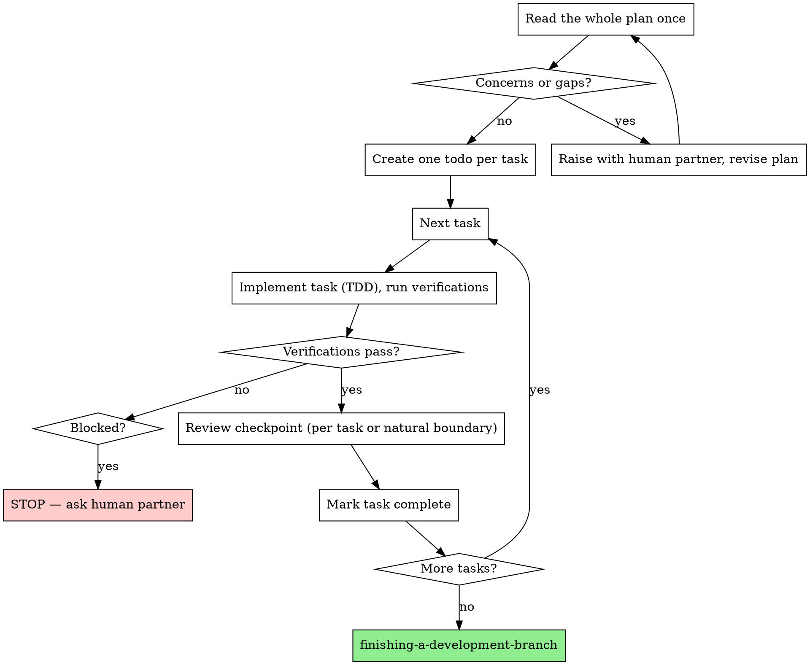

# Executing Plans

## Overview

Load plan, review critically, execute all tasks, report when complete.

**Announce at start:** "I'm using the executing-plans skill to implement this plan."

**Note:** Tell your human partner that Superpowers works much better with access to subagents. The quality of its work will be significantly higher if run on a platform with subagent support (Claude Code, Codex CLI, Codex App, Copilot CLI, and Gemini CLI all qualify; see the per-platform tool refs in `../using-superpowers/references/`). If subagents are available, use superpowers:subagent-driven-development instead of this skill.

## The Flow



## The Process

### Step 1: Load and Review the Plan

1. **Read the entire plan once before touching code.** You need the whole shape — task ordering, shared interfaces, global constraints — before executing task 1.
2. Review critically — identify questions, contradictions, or gaps. Tasks that contradict each other, steps that depend on something the plan never creates, acceptance criteria that conflict.
3. **If concerns:** raise them all as one batched message to your human partner *before* starting, not one interruption per discovery mid-execution.
4. **If no concerns:** create one todo per task and proceed.

You are executing in a *separate session* from where the plan was written. The plan is your only shared context — trust it over your own assumptions, but stop and ask when it is wrong.

### Step 2: Execute Task by Task

Work one task at a time, top to bottom. For each task:

| # | Action | Why |
|---|--------|-----|
| 1 | Mark the todo `in_progress` | One task active at a time — no parallel drift |
| 2 | Follow each step exactly | The plan's steps are bite-sized on purpose |
| 3 | Write the test first (TDD), then the code | See superpowers:test-driven-development |
| 4 | Run the verifications the task specifies | The plan tells you how to prove the task is done |
| 5 | **Review checkpoint** | Catch issues before they compound (see below) |
| 6 | Mark the todo `completed` | Only after verifications pass *and* review is clean |

**Per-task checklist (before marking a task complete):**

- [ ] Every step in the task was executed (none skipped, none invented)
- [ ] The task's specified verification/tests run and pass
- [ ] Test output is pristine (no stray warnings or errors)
- [ ] No work spilled into the *next* task's scope
- [ ] Review checkpoint done (or deferred to a stated natural boundary)

### Step 2a: Review Checkpoints

Reviews keep small mistakes from cascading across the rest of the plan. You have access to subagents on most platforms — dispatch a reviewer rather than grading your own work.

- **After each task** (preferred) or **at a natural boundary** (a coherent group of tasks), dispatch a code reviewer. Use superpowers:requesting-code-review and its `../requesting-code-review/code-reviewer.md` template, giving it the BASE..HEAD range for the work just completed.
- **Fix Critical and Important findings before the next task.** Note Minor findings and carry them to the end.
- If a finding contradicts what the plan mandates, that is the human's call — present the finding beside the plan text and ask which governs.
- No subagents on your platform? Re-read the diff with fresh eyes against the task's acceptance criteria before continuing.

### Step 3: Complete Development

After **all** tasks are complete, verified, and reviewed:

- Announce: "I'm using the finishing-a-development-branch skill to complete this work."
- **REQUIRED SUB-SKILL:** Use superpowers:finishing-a-development-branch
- Follow that skill to verify the full suite, present the merge/PR options, and execute the choice.

## Example

```
You: I'm using the executing-plans skill to implement
     docs/superpowers/plans/2026-06-28-retry-logic.md.

[Read the whole plan: 3 tasks. One concern: Task 2 references a
 RETRY_MAX constant Task 1 never defines.]

You: Before I start — Task 2 uses RETRY_MAX but Task 1 doesn't
     define it. Should Task 1 add it, or is it defined elsewhere?
Partner: Good catch — add it to Task 1's config module.

[Create 3 todos]

Task 1: Add retry config  → in_progress
  [RED] write failing test for config defaults
  [GREEN] implement, RETRY_MAX added per partner
  [verify] 4/4 passing, output pristine
  [review] dispatch reviewer for BASE..HEAD → clean
  → completed

Task 2: Implement retryOperation  → in_progress
  ...verify 8/8 passing...
  [review] Important: magic number in backoff calc
  [fix] extract BACKOFF_BASE constant, re-run tests
  → completed

Task 3: Wire retry into client  → completed (review clean)

[All tasks done]
You: I'm using the finishing-a-development-branch skill to complete this work.
```

## When to Stop and Ask for Help

**STOP executing immediately when:**
- Hit a blocker (missing dependency, test fails, instruction unclear)
- Plan has critical gaps preventing starting
- You don't understand an instruction
- Verification fails repeatedly

**Ask for clarification rather than guessing.**

## When to Revisit Earlier Steps

**Return to Review (Step 1) when:**
- Partner updates the plan based on your feedback
- Fundamental approach needs rethinking

**Don't force through blockers** - stop and ask.

## Remember
- Review plan critically first
- Follow plan steps exactly
- Don't skip verifications
- Reference skills when plan says to
- Stop when blocked, don't guess
- Never start implementation on main/master branch without explicit user consent

## Integration

**Required workflow skills:**
- **superpowers:using-git-worktrees** - Ensures isolated workspace (creates one or verifies existing)
- **superpowers:writing-plans** - Creates the plan this skill executes
- **superpowers:finishing-a-development-branch** - Complete development after all tasks

**Used during execution:**
- **superpowers:test-driven-development** - Each task is implemented test-first
- **superpowers:requesting-code-review** - Drives the per-task review checkpoints
- **superpowers:subagent-driven-development** - Preferred alternative when subagents are available (same session, fresh subagent per task)

## Referências

- Code reviewer prompt template for the review checkpoints: `../requesting-code-review/code-reviewer.md`
- Per-platform tool/subagent mappings (to confirm your runtime supports subagents): `../using-superpowers/references/claude-code-tools.md`, `../using-superpowers/references/codex-tools.md`, `../using-superpowers/references/copilot-tools.md`, `../using-superpowers/references/gemini-tools.md`

