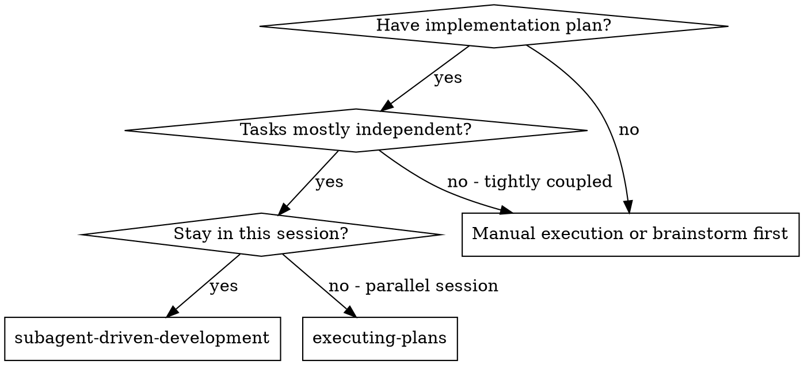
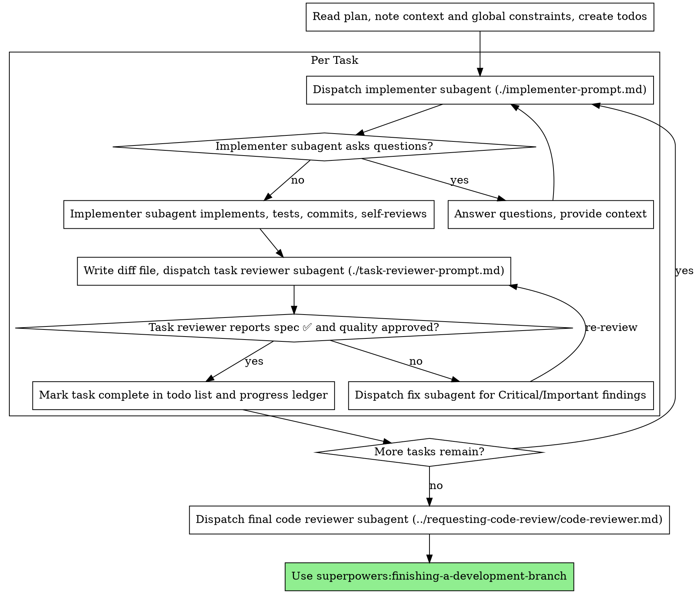

# Subagent-Driven Development

Execute plan by dispatching a fresh implementer subagent per task, a task review (spec compliance + code quality) after each, and a broad whole-branch review at the end.

**Why subagents:** You delegate tasks to specialized agents with isolated context. By precisely crafting their instructions and context, you ensure they stay focused and succeed at their task. They should never inherit your session's context or history — you construct exactly what they need. This also preserves your own context for coordination work.

**Core principle:** Fresh subagent per task + task review (spec + quality) + broad final review = high quality, fast iteration

**Narration:** between tool calls, narrate at most one short line — the
ledger and the tool results carry the record.

**Continuous execution:** Do not pause to check in with your human partner between tasks. Execute all tasks from the plan without stopping. The only reasons to stop are: BLOCKED status you cannot resolve, ambiguity that genuinely prevents progress, or all tasks complete. "Should I continue?" prompts and progress summaries waste their time — they asked you to execute the plan, so execute it.

## When to Use



**vs. Executing Plans (parallel session):**
- Same session (no context switch)
- Fresh subagent per task (no context pollution)
- Review after each task (spec compliance + code quality), broad review at the end
- Faster iteration (no human-in-loop between tasks)

## The Process



## Pre-Flight Plan Review

Before dispatching Task 1, scan the plan once for conflicts:

- tasks that contradict each other or the plan's Global Constraints
- anything the plan explicitly mandates that the review rubric treats as a
  defect (a test that asserts nothing, verbatim duplication of a logic block)

Present everything you find to your human partner as one batched question —
each finding beside the plan text that mandates it, asking which governs —
before execution begins, not one interrupt per discovery mid-plan. If the
scan is clean, proceed without comment. The review loop remains the net for
conflicts that only emerge from implementation.

## Model Selection

Use the least powerful model that can handle each role to conserve cost and increase speed.

**Mechanical implementation tasks** (isolated functions, clear specs, 1-2 files): use a fast, cheap model. Most implementation tasks are mechanical when the plan is well-specified.

**Integration and judgment tasks** (multi-file coordination, pattern matching, debugging): use a standard model.

**Architecture and design tasks**: use the most capable available model.
The final whole-branch review is one of these — dispatch it on the most
capable available model, not the session default.

**Review tasks**: choose the model with the same judgment, scaled to the
diff's size, complexity, and risk. A small mechanical diff does not need the
most capable model; a subtle concurrency change does.

**Always specify the model explicitly when dispatching a subagent.** An
omitted model inherits your session's model — often the most capable and
most expensive — which silently defeats this section.

**Turn count beats token price.** Wall-clock and context cost scale with how
many turns a subagent takes, and the cheapest models routinely take 2-3× the
turns on multi-step work — costing more overall. Use a mid-tier model as the
floor for reviewers and for implementers working from prose descriptions.
When the task's plan text contains the complete code to write, the
implementation is transcription plus testing: use the cheapest tier for
that implementer. Single-file mechanical fixes also take the cheapest tier.

**Task complexity signals (implementation tasks):**
- Touches 1-2 files with a complete spec → cheap model
- Touches multiple files with integration concerns → standard model
- Requires design judgment or broad codebase understanding → most capable model

## Handling Implementer Status

Implementer subagents report one of four statuses. Handle each appropriately:

**DONE:** Generate the review package (`scripts/review-package BASE HEAD`, from this skill's directory — it prints the unique file path it wrote; BASE is the commit you recorded before dispatching the implementer — never `HEAD~1`, which silently drops all but the last commit of a multi-commit task), then dispatch the task reviewer with the printed path.

**DONE_WITH_CONCERNS:** The implementer completed the work but flagged doubts. Read the concerns before proceeding. If the concerns are about correctness or scope, address them before review. If they're observations (e.g., "this file is getting large"), note them and proceed to review.

**NEEDS_CONTEXT:** The implementer needs information that wasn't provided. Provide the missing context and re-dispatch.

**BLOCKED:** The implementer cannot complete the task. Assess the blocker:
1. If it's a context problem, provide more context and re-dispatch with the same model
2. If the task requires more reasoning, re-dispatch with a more capable model
3. If the task is too large, break it into smaller pieces
4. If the plan itself is wrong, escalate to the human

**Never** ignore an escalation or force the same model to retry without changes. If the implementer said it's stuck, something needs to change.

## Handling Reviewer ⚠️ Items

The task reviewer may report "⚠️ Cannot verify from diff" items — requirements
that live in unchanged code or span tasks. These do not block the rest of the
review, but you must resolve each one yourself before marking the task
complete: you hold the plan and cross-task context the reviewer
lacks. If you confirm an item is a real gap, treat it as a failed spec
review — send it back to the implementer and re-review.

## Constructing Reviewer Prompts

Per-task reviews are task-scoped gates. The broad review happens once, at the
final whole-branch review. When you fill a reviewer template:

- Do not add open-ended directives like "check all uses" or "run race tests
  if useful" without a concrete, task-specific reason
- Do not ask a reviewer to re-run tests the implementer already ran on the
  same code — the implementer's report carries the test evidence
- Do not pre-judge findings for the reviewer — never instruct a reviewer to
  ignore or not flag a specific issue. If you believe a finding would be a
  false positive, let the reviewer raise it and adjudicate it in the review
  loop. If the prompt you are writing contains "do not flag," "don't treat X
  as a defect," "at most Minor," or "the plan chose" — stop: you are
  pre-judging, usually to spare yourself a review loop.
- The global-constraints block you hand the reviewer is its attention
  lens. Copy the binding requirements verbatim from the plan's Global
  Constraints section or the spec: exact values, exact formats, and the
  stated relationships between components ("same layout as X", "matches
  Y"). The reviewer's template already carries the process rules (YAGNI,
  test hygiene, review method) — the constraints block is for what THIS
  project's spec demands.
- Hand the reviewer its diff as a file: run this skill's
  `scripts/review-package BASE HEAD` and pass the reviewer the file path
  it prints (or, without bash: `git log --oneline`, `git diff --stat`,
  and `git diff -U10` for the range, redirected to one uniquely named
  file). The output never enters your own context, and the reviewer sees
  the commit list, stat summary, and full diff with context in one Read
  call. Use the BASE you recorded before dispatching the implementer —
  never `HEAD~1`, which silently truncates multi-commit tasks.
- A dispatch prompt describes one task, not the session's history. Do not
  paste accumulated prior-task summaries ("state after Tasks 1-3") into
  later dispatches — a real session's dispatch hit 42k chars of which 99%
  was pasted history. A fresh subagent needs its task, the interfaces it
  touches, and the global constraints. Nothing else.
- Dispatch fix subagents for Critical and Important findings. Record Minor
  findings in the progress ledger as you go, and point the final
  whole-branch review at that list so it can triage which must be fixed
  before merge. A roll-up nobody reads is a silent discard.
- A finding labeled plan-mandated — or any finding that conflicts with
  what the plan's text requires — is the human's decision, like any plan
  contradiction: present the finding and the plan text, ask which governs.
  Do not dismiss the finding because the plan mandates it, and do not
  dispatch a fix that contradicts the plan without asking.
- The final whole-branch review gets a package too: run
  `scripts/review-package MERGE_BASE HEAD` (MERGE_BASE = the commit the
  branch started from, e.g. `git merge-base main HEAD`) and include the
  printed path in the final review dispatch, so the final reviewer reads
  one file instead of re-deriving the branch diff with git commands.
- Every fix dispatch carries the implementer contract: the fix subagent
  re-runs the tests covering its change and reports the results. Name the
  covering test files in the dispatch — a one-line fix does not need the
  whole suite. Before re-dispatching the reviewer, confirm the fix report
  contains the covering tests, the command run, and the output; dispatch
  the re-review once all three are present.
- If the final whole-branch review returns findings, dispatch ONE fix
  subagent with the complete findings list — not one fixer per finding.
  Per-finding fixers each rebuild context and re-run suites; a real
  session's final-review fix wave cost more than all its tasks combined.

## File Handoffs

Everything you paste into a dispatch prompt — and everything a subagent
prints back — stays resident in your context for the rest of the session
and is re-read on every later turn. Hand artifacts over as files:

- **Task brief:** before dispatching an implementer, run this skill's
  `scripts/task-brief PLAN_FILE N` — it extracts the task's full text to a
  uniquely named file and prints the path. Compose the dispatch so the
  brief stays the single source of requirements. Your dispatch should
  contain: (1) one line on where this task fits in the project; (2) the
  brief path, introduced as "read this first — it is your requirements,
  with the exact values to use verbatim"; (3) interfaces and decisions
  from earlier tasks that the brief cannot know; (4) your resolution of
  any ambiguity you noticed in the brief; (5) the report-file path and
  report contract. Exact values (numbers, magic strings, signatures, test
  cases) appear only in the brief.
- **Report file:** name the implementer's report file after the brief
  (brief `…/task-N-brief.md` → report `…/task-N-report.md`) and put it in
  the dispatch prompt. The implementer writes the full report there and
  returns only status, commits, a one-line test summary, and concerns.
- **Reviewer inputs:** the task reviewer gets three paths — the same brief
  file, the report file, and the review package — plus the global
  constraints that bind the task.
- Fix dispatches append their fix report (with test results) to the same
  report file and return a short summary; re-reviews read the updated file.

## Durable Progress

Conversation memory does not survive compaction. In real sessions,
controllers that lost their place have re-dispatched entire completed task
sequences — the single most expensive failure observed. Track progress in
a ledger file, not only in todos.

- At skill start, check for a ledger:
  `cat "$(git rev-parse --show-toplevel)/.superpowers/sdd/progress.md"`. Tasks listed there
  as complete are DONE — do not re-dispatch them; resume at the first task
  not marked complete.
- When a task's review comes back clean, append one line to the ledger in
  the same message as your other bookkeeping:
  `Task N: complete (commits <base7>..<head7>, review clean)`.
- The ledger is your recovery map: the commits it names exist in git even
  when your context no longer remembers creating them. After compaction,
  trust the ledger and `git log` over your own recollection.
- `git clean -fdx` will destroy the ledger (it's git-ignored scratch); if
  that happens, recover from `git log`.

## Prompt Templates

- [implementer-prompt.md](implementer-prompt.md) - Dispatch implementer subagent
- [task-reviewer-prompt.md](task-reviewer-prompt.md) - Dispatch task reviewer subagent (spec compliance + code quality)
- Final whole-branch review: use superpowers:requesting-code-review's [code-reviewer.md](../requesting-code-review/code-reviewer.md)

## Example Workflow

```
You: I'm using Subagent-Driven Development to execute this plan.

[Read plan file once: docs/superpowers/plans/feature-plan.md]
[Create todos for all tasks]

Task 1: Hook installation script

[Run task-brief for Task 1; dispatch implementer with brief + report paths + context]

Implementer: "Before I begin - should the hook be installed at user or system level?"

You: "User level (~/.config/superpowers/hooks/)"

Implementer: "Got it. Implementing now..."
[Later] Implementer:
  - Implemented install-hook command
  - Added tests, 5/5 passing
  - Self-review: Found I missed --force flag, added it
  - Committed

[Run review-package, dispatch task reviewer with the printed path]
Task reviewer: Spec ✅ - all requirements met, nothing extra.
  Strengths: Good test coverage, clean. Issues: None. Task quality: Approved.

[Mark Task 1 complete]

Task 2: Recovery modes

[Run task-brief for Task 2; dispatch implementer with brief + report paths + context]

Implementer: [No questions, proceeds]
Implementer:
  - Added verify/repair modes
  - 8/8 tests passing
  - Self-review: All good
  - Committed

[Run review-package, dispatch task reviewer with the printed path]
Task reviewer: Spec ❌:
  - Missing: Progress reporting (spec says "report every 100 items")
  - Extra: Added --json flag (not requested)
  Issues (Important): Magic number (100)

[Dispatch fix subagent with all findings]
Fixer: Removed --json flag, added progress reporting, extracted PROGRESS_INTERVAL constant

[Task reviewer reviews again]
Task reviewer: Spec ✅. Task quality: Approved.

[Mark Task 2 complete]

...

[After all tasks]
[Dispatch final code-reviewer]
Final reviewer: All requirements met, ready to merge

Done!
```

## Advantages

**vs. Manual execution:**
- Subagents follow TDD naturally
- Fresh context per task (no confusion)
- Parallel-safe (subagents don't interfere)
- Subagent can ask questions (before AND during work)

**vs. Executing Plans:**
- Same session (no handoff)
- Continuous progress (no waiting)
- Review checkpoints automatic

**Efficiency gains:**
- Controller curates exactly what context is needed; bulk artifacts move
  as files, not pasted text
- Subagent gets complete information upfront
- Questions surfaced before work begins (not after)

**Quality gates:**
- Self-review catches issues before handoff
- Task review carries two verdicts: spec compliance and code quality
- Review loops ensure fixes actually work
- Spec compliance prevents over/under-building
- Code quality ensures implementation is well-built

**Cost:**
- More subagent invocations (implementer + reviewer per task)
- Controller does more prep work (extracting all tasks upfront)
- Review loops add iterations
- But catches issues early (cheaper than debugging later)

## Red Flags

**Never:**
- Start implementation on main/master branch without explicit user consent
- Skip task review, or accept a report missing either verdict (spec compliance AND task quality are both required)
- Proceed with unfixed issues
- Dispatch multiple implementation subagents in parallel (conflicts)
- Make a subagent read the whole plan file (hand it its task brief —
  `scripts/task-brief` — instead)
- Skip scene-setting context (subagent needs to understand where task fits)
- Ignore subagent questions (answer before letting them proceed)
- Accept "close enough" on spec compliance (reviewer found spec issues = not done)
- Skip review loops (reviewer found issues = implementer fixes = review again)
- Let implementer self-review replace actual review (both are needed)
- Tell a reviewer what not to flag, or pre-rate a finding's severity in the
  dispatch prompt ("treat it as Minor at most") — the plan's example code is
  a starting point, not evidence that its weaknesses were chosen
- Dispatch a task reviewer without a diff file — generate it first
  (`scripts/review-package BASE HEAD`) and name the printed path in the
  prompt
- Move to next task while the review has open Critical/Important issues
- Re-dispatch a task the progress ledger already marks complete — check
  the ledger (and `git log`) after any compaction or resume

**If subagent asks questions:**
- Answer clearly and completely
- Provide additional context if needed
- Don't rush them into implementation

**If reviewer finds issues:**
- Implementer (same subagent) fixes them
- Reviewer reviews again
- Repeat until approved
- Don't skip the re-review

**If subagent fails task:**
- Dispatch fix subagent with specific instructions
- Don't try to fix manually (context pollution)

## Integration

**Required workflow skills:**
- **superpowers:using-git-worktrees** - Ensures isolated workspace (creates one or verifies existing)
- **superpowers:writing-plans** - Creates the plan this skill executes
- **superpowers:requesting-code-review** - Code review template for the final whole-branch review
- **superpowers:finishing-a-development-branch** - Complete development after all tasks

**Subagents should use:**
- **superpowers:test-driven-development** - Subagents follow TDD for each task

**Alternative workflow:**
- **superpowers:executing-plans** - Use for parallel session instead of same-session execution


---

## Arquivo de apoio: `implementer-prompt.md`

# Implementer Subagent Prompt Template

Use this template when dispatching an implementer subagent.

```
Subagent (general-purpose):
  description: "Implement Task N: [task name]"
  model: [MODEL — REQUIRED: choose per SKILL.md Model Selection; an omitted
         model silently inherits the session's most expensive one]
  prompt: |
    You are implementing Task N: [task name]

    ## Task Description

    Read your task brief first: [BRIEF_FILE]
    It contains the full task text from the plan.

    ## Context

    [Scene-setting: where this fits, dependencies, architectural context]

    ## Before You Begin

    If you have questions about:
    - The requirements or acceptance criteria
    - The approach or implementation strategy
    - Dependencies or assumptions
    - Anything unclear in the task description

    **Ask them now.** Raise any concerns before starting work.

    ## Your Job

    Once you're clear on requirements:
    1. Implement exactly what the task specifies
    2. Write tests (following TDD if task says to)
    3. Verify implementation works
    4. Commit your work
    5. Self-review (see below)
    6. Report back

    Work from: [directory]

    **While you work:** If you encounter something unexpected or unclear, **ask questions**.
    It's always OK to pause and clarify. Don't guess or make assumptions.

    While iterating, run the focused test for what you're changing; run the
    full suite once before committing, not after every edit.

    ## Code Organization

    You reason best about code you can hold in context at once, and your edits are more
    reliable when files are focused. Keep this in mind:
    - Follow the file structure defined in the plan
    - Each file should have one clear responsibility with a well-defined interface
    - If a file you're creating is growing beyond the plan's intent, stop and report
      it as DONE_WITH_CONCERNS — don't split files on your own without plan guidance
    - If an existing file you're modifying is already large or tangled, work carefully
      and note it as a concern in your report
    - In existing codebases, follow established patterns. Improve code you're touching
      the way a good developer would, but don't restructure things outside your task.

    ## When You're in Over Your Head

    It is always OK to stop and say "this is too hard for me." Bad work is worse than
    no work. You will not be penalized for escalating.

    **STOP and escalate when:**
    - The task requires architectural decisions with multiple valid approaches
    - You need to understand code beyond what was provided and can't find clarity
    - You feel uncertain about whether your approach is correct
    - The task involves restructuring existing code in ways the plan didn't anticipate
    - You've been reading file after file trying to understand the system without progress

    **How to escalate:** Report back with status BLOCKED or NEEDS_CONTEXT. Describe
    specifically what you're stuck on, what you've tried, and what kind of help you need.
    The controller can provide more context, re-dispatch with a more capable model,
    or break the task into smaller pieces.

    ## Before Reporting Back: Self-Review

    Review your work with fresh eyes. Ask yourself:

    **Completeness:**
    - Did I fully implement everything in the spec?
    - Did I miss any requirements?
    - Are there edge cases I didn't handle?

    **Quality:**
    - Is this my best work?
    - Are names clear and accurate (match what things do, not how they work)?
    - Is the code clean and maintainable?

    **Discipline:**
    - Did I avoid overbuilding (YAGNI)?
    - Did I only build what was requested?
    - Did I follow existing patterns in the codebase?

    **Testing:**
    - Do tests actually verify behavior (not just mock behavior)?
    - Did I follow TDD if required?
    - Are tests comprehensive?
    - Is the test output pristine (no stray warnings or noise)?

    If you find issues during self-review, fix them now before reporting.

    ## After Review Findings

    If a reviewer finds issues and you fix them, re-run the tests that cover
    the amended code and append the results to your report file. Reviewers
    will not re-run tests for you — your report is the test evidence.

    ## Report Format

    Write your full report to [REPORT_FILE]:
    - What you implemented (or what you attempted, if blocked)
    - What you tested and test results
    - **TDD Evidence** (if TDD was required for this task):
      - RED: command run, relevant failing output before implementation, and why the failure was expected
      - GREEN: command run and relevant passing output after implementation
    - Files changed
    - Self-review findings (if any)
    - Any issues or concerns

    Then report back with ONLY (under 15 lines — the detail lives in the
    report file):
    - **Status:** DONE | DONE_WITH_CONCERNS | BLOCKED | NEEDS_CONTEXT
    - Commits created (short SHA + subject)
    - One-line test summary (e.g. "14/14 passing, output pristine")
    - Your concerns, if any
    - The report file path

    If BLOCKED or NEEDS_CONTEXT, put the specifics in the final message
    itself — the controller acts on it directly.

    Use DONE_WITH_CONCERNS if you completed the work but have doubts about correctness.
    Use BLOCKED if you cannot complete the task. Use NEEDS_CONTEXT if you need
    information that wasn't provided. Never silently produce work you're unsure about.
```


---

## Arquivo de apoio: `scripts/review-package`

```
#!/usr/bin/env bash
# Generate a review package: commit list, stat summary, and the net
# diff with extended context, written to a file the reviewer reads in one
# call. Using the recorded per-task BASE (not HEAD~1) keeps multi-commit
# tasks intact.
#
# Usage: review-package BASE HEAD [OUTFILE]
# Default OUTFILE: <repo-root>/.superpowers/sdd/review-<base7>..<head7>.diff
# (named per range, so a re-review after fixes gets a distinct fresh file).
set -euo pipefail

if [ $# -lt 2 ] || [ $# -gt 3 ]; then
  echo "usage: review-package BASE HEAD [OUTFILE]" >&2
  exit 2
fi

base=$1
head=$2

git rev-parse --verify --quiet "$base" >/dev/null || { echo "bad BASE: $base" >&2; exit 2; }
git rev-parse --verify --quiet "$head" >/dev/null || { echo "bad HEAD: $head" >&2; exit 2; }

if [ $# -eq 3 ]; then
  out=$3
else
  dir=$("$(cd "$(dirname "$0")" && pwd)/sdd-workspace")
  out="$dir/review-$(git rev-parse --short "$base")..$(git rev-parse --short "$head").diff"
fi

{
  echo "# Review package: ${base}..${head}"
  echo
  echo "## Commits"
  git log --oneline "${base}..${head}"
  echo
  echo "## Files changed"
  git diff --stat "${base}..${head}"
  echo
  echo "## Diff"
  git diff -U10 "${base}..${head}"
} > "$out"

commits=$(git rev-list --count "${base}..${head}")
echo "wrote ${out}: ${commits} commit(s), $(wc -c < "$out" | tr -d ' ') bytes"
```


---

## Arquivo de apoio: `scripts/sdd-workspace`

```
#!/usr/bin/env bash
# Resolve and ensure the working-tree directory SDD uses for its short-lived
# artifacts: task briefs, implementer reports, review packages, and the
# progress ledger. Print the directory's absolute path.
#
# The workspace lives in the working tree (not under .git/) because Claude Code
# treats .git/ as a protected path and denies agent writes there — which blocks
# an implementer subagent from writing its report file. A self-ignoring
# .gitignore keeps the workspace out of `git status` and out of accidental
# commits without modifying any tracked file.
#
# Single source of truth for the workspace location, so task-brief and
# review-package cannot drift to different directories.
#
# Usage: sdd-workspace
set -euo pipefail

root=$(git rev-parse --show-toplevel)
dir="$root/.superpowers/sdd"
mkdir -p "$dir"
printf '*\n' > "$dir/.gitignore"
cd "$dir" && pwd
```


---

## Arquivo de apoio: `scripts/task-brief`

```
#!/usr/bin/env bash
# Extract one task's full text from an implementation plan into a file the
# implementer reads in one call, so the task text never has to be pasted
# through the controller's context.
#
# Usage: task-brief PLAN_FILE TASK_NUMBER [OUTFILE]
# Default OUTFILE: <repo-root>/.superpowers/sdd/task-<N>-brief.md
# (per worktree; concurrent runs in the same working tree share it).
set -euo pipefail

if [ $# -lt 2 ] || [ $# -gt 3 ]; then
  echo "usage: task-brief PLAN_FILE TASK_NUMBER [OUTFILE]" >&2
  exit 2
fi

plan=$1
n=$2
[ -f "$plan" ] || { echo "no such plan file: $plan" >&2; exit 2; }

if [ $# -eq 3 ]; then
  out=$3
else
  dir=$("$(cd "$(dirname "$0")" && pwd)/sdd-workspace")
  out="$dir/task-${n}-brief.md"
fi

awk -v n="$n" '
  /^```/ { infence = !infence }
  !infence && /^#+[ \t]+Task[ \t]+[0-9]+/ {
    intask = ($0 ~ ("^#+[ \t]+Task[ \t]+" n "([^0-9]|$)"))
  }
  intask { print }
' "$plan" > "$out"

if [ ! -s "$out" ]; then
  echo "task ${n} not found in ${plan} (no heading matching 'Task ${n}')" >&2
  exit 3
fi

echo "wrote ${out}: $(wc -l < "$out" | tr -d ' ') lines"
```


---

## Arquivo de apoio: `task-reviewer-prompt.md`

# Task Reviewer Prompt Template

Use this template when dispatching a task reviewer subagent. The reviewer
reads the task's diff once and returns two verdicts: spec compliance and
code quality.

**Purpose:** Verify one task's implementation matches its requirements (nothing
more, nothing less) and is well-built (clean, tested, maintainable)

```
Subagent (general-purpose):
  description: "Review Task N (spec + quality)"
  model: [MODEL — REQUIRED: choose per SKILL.md Model Selection; an omitted
         model silently inherits the session's most expensive one]
  prompt: |
    You are reviewing one task's implementation: first whether it matches its
    requirements, then whether it is well-built. This is a task-scoped gate,
    not a merge review — a broad whole-branch review happens separately after
    all tasks are complete.

    ## What Was Requested

    Read the task brief: [BRIEF_FILE]

    Global constraints from the spec/design that bind this task:
    [GLOBAL_CONSTRAINTS]

    ## What the Implementer Claims They Built

    Read the implementer's report: [REPORT_FILE]

    ## Diff Under Review

    **Base:** [BASE_SHA]
    **Head:** [HEAD_SHA]
    **Diff file:** [DIFF_FILE]

    Read the diff file once — it contains the commit list, a stat summary,
    and the full diff with surrounding context, and it is your view of the
    change. The diff's context lines ARE the changed files: do not Read a
    changed file separately unless a hunk you must judge is cut off
    mid-function — and say so in your report. Do not re-run git commands.
    If the diff file is missing, fetch the diff yourself:
    `git diff --stat [BASE_SHA]..[HEAD_SHA]` and `git diff [BASE_SHA]..[HEAD_SHA]`.
    Do not crawl the broader codebase. Inspect code outside the diff only
    to evaluate a concrete risk you can name — one focused check per named
    risk, and name both the risk and what you checked in your report.
    Cross-cutting changes are legitimate named risks: if the diff changes
    lock ordering, a function or API contract, or shared mutable state,
    checking the call sites is the right method.

    Your review is read-only on this checkout. Do not mutate the working
    tree, the index, HEAD, or branch state in any way.

    ## Do Not Trust the Report

    Treat the implementer's report as unverified claims about the code. It
    may be incomplete, inaccurate, or optimistic. Verify the claims against
    the diff. Design rationales in the report are claims too: "left it per
    YAGNI," "kept it simple deliberately," or any other justification is the
    implementer grading their own work. Judge the code on its merits — a
    stated rationale never downgrades a finding's severity.

    ## Tests

    The implementer already ran the tests and reported results with TDD
    evidence for exactly this code. Do not re-run the suite to confirm their
    report. Run a test only when reading the code raises a specific doubt
    that no existing run answers — and then a focused test, never a
    package-wide suite, race detector run, or repeated/high-count loop. If
    heavy validation seems warranted, recommend it in your report instead of
    running it. If you cannot run commands in this environment, name the
    test you would run.

    Warnings or other noise in the implementer's reported test output are
    findings — test output should be pristine.

    ## Part 1: Spec Compliance

    Compare the diff against What Was Requested:

    - **Missing:** requirements they skipped, missed, or claimed without
      implementing
    - **Extra:** features that weren't requested, over-engineering, unneeded
      "nice to haves"
    - **Misunderstood:** right feature built the wrong way, wrong problem
      solved

    If a requirement cannot be verified from this diff alone (it lives in
    unchanged code or spans tasks), report it as a ⚠️ item instead of
    broadening your search.

    ## Part 2: Code Quality

    **Code quality:**
    - Clean separation of concerns?
    - Proper error handling?
    - DRY without premature abstraction?
    - Edge cases handled?

    **Tests:**
    - Do the new and changed tests verify real behavior, not mocks?
    - Are the task's edge cases covered?

    **Structure:**
    - Does each file have one clear responsibility with a well-defined interface?
    - Are units decomposed so they can be understood and tested independently?
    - Is the implementation following the file structure from the plan?
    - Did this change create new files that are already large, or
      significantly grow existing files? (Don't flag pre-existing file
      sizes — focus on what this change contributed.)

    Your report should point at evidence: file:line references for every
    finding and for any check you would otherwise answer with a bare
    "yes." A tight report that cites lines gives the controller everything
    it needs.

    Your final message is the report itself: begin directly with the
    spec-compliance verdict. Every line is a verdict, a finding with
    file:line, or a check you ran — no preamble, no process narration,
    no closing summary.

    ## Calibration

    Categorize issues by actual severity. Not everything is Critical.
    Important means this task cannot be trusted until it is fixed: incorrect
    or fragile behavior, a missed requirement, or maintainability damage you
    would block a merge over — verbatim duplication of a logic block,
    swallowed errors, tests that assert nothing. "Coverage could be broader"
    and polish suggestions are Minor.
    If the plan or brief explicitly mandates something this rubric calls a
    defect (a test that asserts nothing, verbatim duplication of a logic
    block), that IS a finding — report it as Important, labeled
    plan-mandated. The plan's authorship does not grade its own work; the
    human decides.
    Acknowledge what was done well before listing issues — accurate praise
    helps the implementer trust the rest of the feedback.

    ## Output Format

    ### Spec Compliance

    - ✅ Spec compliant | ❌ Issues found: [what's missing/extra/misunderstood,
      with file:line references]
    - ⚠️ Cannot verify from diff: [requirements you could not verify from the
      diff alone, and what the controller should check — report alongside the
      ✅/❌ verdict for everything you could verify]

    ### Strengths
    [What's well done? Be specific.]

    ### Issues

    #### Critical (Must Fix)
    #### Important (Should Fix)
    #### Minor (Nice to Have)

    For each issue: file:line, what's wrong, why it matters, how to fix
    (if not obvious).

    ### Assessment

    **Task quality:** [Approved | Needs fixes]

    **Reasoning:** [1-2 sentence technical assessment]
```

**Placeholders:**
- `[MODEL]` — REQUIRED: reviewer model per SKILL.md Model Selection
- `[BRIEF_FILE]` — REQUIRED: the task brief file (`scripts/task-brief PLAN N`
  prints the path; same file the implementer worked from)
- `[GLOBAL_CONSTRAINTS]` — the binding requirements copied verbatim from
  the plan's Global Constraints section or the spec: exact values, formats,
  and stated relationships between components (not process rules — those
  are already in this template)
- `[REPORT_FILE]` — REQUIRED: the file the implementer wrote its detailed
  report to
- `[BASE_SHA]` — commit before this task
- `[HEAD_SHA]` — current commit
- `[DIFF_FILE]` — REQUIRED: the path the controller wrote the review
  package to (`scripts/review-package BASE HEAD` prints the unique path it
  wrote; the package never enters the controller's context)

**Reviewer returns:** Spec Compliance verdict (✅/❌/⚠️), Strengths, Issues
(Critical/Important/Minor), Task quality verdict

A fix dispatch can address spec gaps and quality findings together;
re-review after fixes covers both verdicts.

