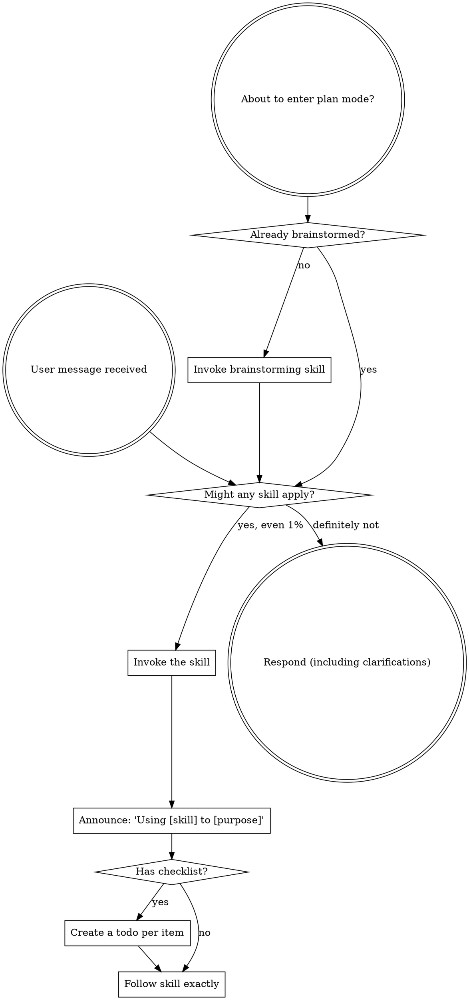

<SUBAGENT-STOP>
If you were dispatched as a subagent to execute a specific task, skip this skill.
</SUBAGENT-STOP>

<EXTREMELY-IMPORTANT>
If you think there is even a 1% chance a skill might apply to what you are doing, you ABSOLUTELY MUST invoke the skill.

IF A SKILL APPLIES TO YOUR TASK, YOU DO NOT HAVE A CHOICE. YOU MUST USE IT.

This is not negotiable. This is not optional. You cannot rationalize your way out of this.
</EXTREMELY-IMPORTANT>

## Instruction Priority

Superpowers skills override default system prompt behavior, but **user instructions always take precedence**:

1. **User's explicit instructions** (CLAUDE.md, GEMINI.md, AGENTS.md, direct requests) — highest priority
2. **Superpowers skills** — override default system behavior where they conflict
3. **Default system prompt** — lowest priority

If CLAUDE.md, GEMINI.md, or AGENTS.md says "don't use TDD" and a skill says "always use TDD," follow the user's instructions. The user is in control.

## How to Access Skills

**Never read skill files manually with file tools** — always use your platform's skill-loading mechanism so the skill is properly activated.

**In Claude Code:** Use the `Skill` tool. When you invoke a skill, its content is loaded and presented to you — follow it directly.

**In Codex:** Skills load natively. Follow the instructions presented when a skill activates.

**In Copilot CLI:** Use the `skill` tool. Skills are auto-discovered from installed plugins.

**In Gemini CLI:** Skills activate via the `activate_skill` tool. Gemini loads skill metadata at session start and activates the full content on demand.

**In other environments:** Check your platform's documentation for how skills are loaded.

## Platform Adaptation

Skills speak in actions ("dispatch a subagent", "create a todo", "read a file") rather than naming any one runtime's tools. For per-platform tool equivalents and instructions-file conventions, see [claude-code-tools.md](references/claude-code-tools.md), [codex-tools.md](references/codex-tools.md), [copilot-tools.md](references/copilot-tools.md), [gemini-tools.md](references/gemini-tools.md), [pi-tools.md](references/pi-tools.md), and [antigravity-tools.md](references/antigravity-tools.md). Gemini CLI users get the tool mapping loaded automatically via GEMINI.md.

# Using Skills

## The Rule

**Invoke relevant or requested skills BEFORE any response or action.** Even a 1% chance a skill might apply means that you should invoke the skill to check. If an invoked skill turns out to be wrong for the situation, you don't need to use it.



## Red Flags

These thoughts mean STOP—you're rationalizing:

| Thought | Reality |
|---------|---------|
| "This is just a simple question" | Questions are tasks. Check for skills. |
| "I need more context first" | Skill check comes BEFORE clarifying questions. |
| "Let me explore the codebase first" | Skills tell you HOW to explore. Check first. |
| "I can check git/files quickly" | Files lack conversation context. Check for skills. |
| "Let me gather information first" | Skills tell you HOW to gather information. |
| "This doesn't need a formal skill" | If a skill exists, use it. |
| "I remember this skill" | Skills evolve. Read current version. |
| "This doesn't count as a task" | Action = task. Check for skills. |
| "The skill is overkill" | Simple things become complex. Use it. |
| "I'll just do this one thing first" | Check BEFORE doing anything. |
| "This feels productive" | Undisciplined action wastes time. Skills prevent this. |
| "I know what that means" | Knowing the concept ≠ using the skill. Invoke it. |

## Skill Priority

When multiple skills could apply, use this order:

1. **Process skills first** (brainstorming, systematic-debugging) - these determine HOW to approach the task
2. **Implementation skills second** (frontend-design, mcp-builder) - these guide execution

"Let's build X" → brainstorming first, then implementation skills.
"Fix this bug" → systematic-debugging first, then domain-specific skills.

## Skill Types

**Rigid** (TDD, systematic-debugging): Follow exactly. Don't adapt away discipline.

**Flexible** (patterns): Adapt principles to context.

The skill itself tells you which.

## User Instructions

Instructions say WHAT, not HOW. "Add X" or "Fix Y" doesn't mean skip workflows.


---

## Arquivo de apoio: `references/antigravity-tools.md`

# Antigravity CLI (`agy`) Tool Mapping

Skills speak in actions ("dispatch a subagent", "create a todo", "read a file"). On the Antigravity CLI (`agy`) these resolve to the tools below.

| Action skills request | Antigravity CLI equivalent |
|----------------------|----------------------|
| Read a file | `view_file` |
| Create a new file | `write_to_file` |
| Edit a file | `replace_file_content` |
| Edit a file in several places at once | `multi_replace_file_content` |
| Run a shell command | `run_command` |
| Search file contents | `grep_search` |
| Find files by name / list a directory | `list_dir` (no dedicated glob tool — combine `list_dir` with `grep_search`) |
| Fetch a URL | `read_url_content` |
| Search the web | `search_web` |
| Pose a structured question to your human partner | `ask_question` |
| Dispatch a subagent (`Subagent (general-purpose):` template) | `invoke_subagent` with a built-in `TypeName` — `self` for full-capability work, `research` for read-only (see [Subagent support](#subagent-support)) |
| Multiple parallel dispatches | Multiple entries in one `invoke_subagent` call's `Subagents` array |
| Task tracking ("create a todo", "mark complete") | a **task artifact** — `write_to_file` with `IsArtifact: true` and `ArtifactType: "task"` (see [Task tracking](#task-tracking)). **Not** `manage_task`, which manages background processes. |

## Invoking a skill — read its `SKILL.md`

Antigravity surfaces every installed skill's `name` + `description` to you at the
start of each session, but it has **no `Skill`/`activate_skill` tool**. To load a
skill, **read its `SKILL.md` with `view_file`, setting `IsSkillFile: true`** when
the skill applies — e.g. `view_file` on
`.../plugins/superpowers/skills/<skill-name>/SKILL.md` with `IsSkillFile: true`.
(`IsSkillFile` is agy's own signal that you're reading a file to *execute its
instructions*, not to edit or preview it — set it whenever you load a skill.)

This is the blessed skill-loading mechanism on this harness. The general rule
"never read skill files manually" means "don't bypass your platform's
skill-loading mechanism" — and on Antigravity, reading `SKILL.md` *is* that
mechanism. Reading it honors the rule rather than breaking it.

You already know which skills exist and what they're for: their names and
descriptions are in front of you at session start. When a description matches
what you're about to do, read that skill's `SKILL.md` before acting.

## Subagent support

Antigravity dispatches subagents with `invoke_subagent`, passing each one a
`TypeName` in the `Subagents` array. Two `TypeName`s are **built in** — use them
directly, no `define_subagent` needed:

- **`self`** — a full clone of you, with every tool you have (including
  `write_to_file`/`replace_file_content`/`run_command`). The safe default for
  general-purpose work: implementing, fixing, anything that edits files or runs
  commands.
- **`research`** — read-only (file reading, `grep_search`, web/URL fetch; no write
  or command access). Use it when you specifically want a subagent that can't make
  changes — investigation and read-only review.

Call `define_subagent` only for a custom system prompt or capability mix: set
`enable_write_tools: true` to grant file edits **and** `run_command`,
`enable_subagent_tools` for nested dispatch, `enable_mcp_tools` for MCP. Then
invoke it by the name you gave it. (`manage_subagents` lists/kills running
subagents.)

Skills dispatch with `Subagent (general-purpose):` and either reference a
prompt-template file (e.g. `superpowers:subagent-driven-development`'s
`./implementer-prompt.md`) or supply an inline prompt. On Antigravity:

| Skill dispatch form | Antigravity equivalent |
|---------------------|----------------------|
| An implementer-style `*-prompt.md` template (writes code, runs tests) | Fill the template, then `invoke_subagent` with `TypeName: "self"` and the filled prompt |
| A read-only reviewer template (`task-reviewer`, `code-reviewer`, `requesting-code-review`'s `./code-reviewer.md`) | `invoke_subagent` with `TypeName: "research"` and the filled review template |
| Inline prompt (no template referenced) | `invoke_subagent` with `TypeName: "self"` (or `"research"` if the task only reads) and your inline prompt |

### Prompt filling

Skills provide prompt templates with placeholders like `{WHAT_WAS_IMPLEMENTED}` or
`[FULL TEXT of task]`. Fill all placeholders before passing the complete prompt to
`invoke_subagent`. The prompt template itself contains the agent's role, review
criteria, and expected output format — the subagent will follow it.

### Parallel dispatch

Put multiple entries in a single `invoke_subagent` call's `Subagents` array to run
independent subagent work in parallel. Keep dependent tasks sequential, but do not
serialize independent subagent tasks just to preserve a simpler history.

## Task tracking

Antigravity has **no todo / `TodoWrite` tool** (`manage_task` manages background
processes — `list`/`kill`/`status`/`send_input` — it is *not* a checklist). When a
skill says to create a todo list or track tasks, maintain a **task artifact**: a
markdown checklist saved with `write_to_file` (`IsArtifact: true`,
`ArtifactMetadata.ArtifactType: "task"`), edited with `replace_file_content` /
`multi_replace_file_content` as you go.

At the start of any multi-step task, create the task artifact listing every step of
your plan. As you complete each step, edit the artifact to mark it done (`- [x]`).
If the plan changes, update the checklist. Keep it current — it is your source of
truth for what remains; once the conversation gets long, re-read it before starting
each step.


---

## Arquivo de apoio: `references/claude-code-tools.md`

# Claude Code Tool Mapping

Skills speak in actions ("dispatch a subagent", "create a todo", "read a file"). On Claude Code these resolve to the tools below.

## Tools

| Action skills request | Claude Code tool |
|----------------------|------------------|
| Read a file | `Read` |
| Create a new file | `Write` |
| Edit a file | `Edit` |
| Run a shell command | `Bash` |
| Search file contents | `Grep` |
| Find files by name | `Glob` |
| Fetch a URL | `WebFetch` |
| Search the web | `WebSearch` |
| Invoke a skill | `Skill` |
| Dispatch a subagent (`Subagent (general-purpose):` template) | `Agent` (older releases named this `Task`) |
| Multiple parallel dispatches | Multiple `Agent` calls in one response |
| Task tracking ("create a todo", "mark complete") | `TaskCreate`, `TaskUpdate`, `TaskList`, `TaskGet`; `TodoWrite` in `claude -p` / Agent SDK unless `CLAUDE_CODE_ENABLE_TASKS=1` is set |
| Background-process / subagent lifecycle (read output, cancel) | `TaskOutput`, `TaskStop` — these are distinct from the todo tools above and apply to running shells, agents, and remote sessions |

## Instructions file

When a skill mentions "your instructions file", on Claude Code this is **`CLAUDE.md`**. Claude Code walks up the directory tree from the current working directory and concatenates every `CLAUDE.md` and `CLAUDE.local.md` it finds along the way. Standard locations:

| Scope | Location |
|-------|----------|
| Project (team-shared) | `./CLAUDE.md` or `./.claude/CLAUDE.md` |
| User global | `~/.claude/CLAUDE.md` |
| Local-private (gitignored) | `./CLAUDE.local.md` |
| Managed policy (org-wide) | `/Library/Application Support/ClaudeCode/CLAUDE.md` (macOS), `/etc/claude-code/CLAUDE.md` (Linux/WSL), `C:\Program Files\ClaudeCode\CLAUDE.md` (Windows) |

CLAUDE.md files can pull in additional content with `@path/to/file` imports (relative or absolute, max five hops deep). Subdirectory `CLAUDE.md` files are also discovered automatically and loaded on-demand when Claude Code reads files in those subdirectories.

Claude Code does **not** read `AGENTS.md` directly. If a project already maintains `AGENTS.md` for other agents, import it from `CLAUDE.md` so both runtimes share the same instructions:

```markdown
@AGENTS.md

## Claude Code

(Claude-Code-specific instructions go here.)
```

For path-scoped rules and larger-project organization, see `.claude/rules/` (rules can be scoped to specific files via `paths` frontmatter and load on demand).

## Personal skills directory

User-level skills live at **`~/.claude/skills/`**. Each skill is a subdirectory containing a `SKILL.md` (with `name` and `description` frontmatter) plus any supporting files. Claude Code does not currently recognize the cross-runtime `~/.agents/skills/` path that Codex, Copilot CLI, and Gemini CLI read; if you're relying on cross-runtime support in the future, verify against the [official skills docs](https://code.claude.com/docs/en/skills).


---

## Arquivo de apoio: `references/codex-tools.md`

# Codex Tool Mapping

Skills speak in actions ("dispatch a subagent", "create a todo", "read a file"). On Codex these resolve to the tools below.

| Action skills request | Codex equivalent |
|----------------------|------------------|
| Read a file | `shell` (e.g., `cat`, `head`, `tail`) — Codex reads files via shell |
| Create / edit / delete a file | `apply_patch` (structured diff for create, update, delete) |
| Run a shell command | `shell` |
| Search file contents | `shell` (e.g., `grep`, `rg`) |
| Find files by name | `shell` (e.g., `find`, `ls`) |
| Fetch a URL | `shell` with `curl` / `wget` — Codex has no native fetch tool |
| Search the web | `web_search` (enabled by default; configurable in `config.toml` via the top-level `web_search` setting — `live`, `cached`, or `disabled`) |
| Invoke a skill | Skills load natively — just follow the instructions |
| Dispatch a subagent (`Subagent (general-purpose):` template) | `spawn_agent` (see [Subagent dispatch requires multi-agent support](#subagent-dispatch-requires-multi-agent-support)) |
| Multiple parallel dispatches | Multiple `spawn_agent` calls in one response |
| Wait for subagent result | `wait_agent` |
| Free up subagent slot when done | `close_agent` |
| Task tracking ("create a todo", "mark complete") | `update_plan` |

## Instructions file

When a skill mentions "your instructions file", on Codex this is **`AGENTS.md`** at the project root. Codex also reads `~/.codex/AGENTS.md` for global context, and an `AGENTS.override.md` (in the project tree or `~/.codex/`) takes precedence when present. Codex walks from the project root down to the current working directory, concatenating `AGENTS.md` files it finds along the way, up to `project_doc_max_bytes` (32 KiB by default).

## Personal skills directory

User-level skills live at **`$CODEX_HOME/skills/`** (default `~/.codex/skills/`). Codex also reads the cross-runtime path **`~/.agents/skills/`** (shared with Copilot CLI and Gemini CLI). When both directories exist at the same scope, Codex loads them both as separate skill catalogs — Codex's docs don't currently document a precedence between them. Each skill is a subdirectory containing a `SKILL.md` (with `name` and `description` frontmatter).

## Subagent dispatch requires multi-agent support

Add to your Codex config (`~/.codex/config.toml`):

```toml
[features]
multi_agent = true
```

This enables `spawn_agent`, `wait_agent`, and `close_agent` for skills like `dispatching-parallel-agents` and `subagent-driven-development`.

Legacy note: Codex builds before `rust-v0.115.0` exposed spawned-agent
waiting as `wait`. Current Codex uses `wait_agent` for spawned agents. The
`wait` name now belongs to code-mode `exec/wait`, which resumes a yielded exec
cell by `cell_id`; it is not the spawned-agent result tool.

## Environment Detection

Skills that create worktrees or finish branches should detect their
environment with read-only git commands before proceeding:

```bash
GIT_DIR=$(cd "$(git rev-parse --git-dir)" 2>/dev/null && pwd -P)
GIT_COMMON=$(cd "$(git rev-parse --git-common-dir)" 2>/dev/null && pwd -P)
BRANCH=$(git branch --show-current)
```

- `GIT_DIR != GIT_COMMON` → already in a linked worktree (skip creation)
- `BRANCH` empty → detached HEAD (cannot branch/push/PR from sandbox)

See `using-git-worktrees` Step 0 and `finishing-a-development-branch`
Step 1 for how each skill uses these signals.

## Codex App Finishing

When the sandbox blocks branch/push operations (detached HEAD in an
externally managed worktree), the agent commits all work and informs
the user to use the App's native controls:

- **"Create branch"** — names the branch, then commit/push/PR via App UI
- **"Hand off to local"** — transfers work to the user's local checkout

The agent can still run tests, stage files, and output suggested branch
names, commit messages, and PR descriptions for the user to copy.


---

## Arquivo de apoio: `references/copilot-tools.md`

# Copilot CLI Tool Mapping

Skills speak in actions ("dispatch a subagent", "create a todo", "read a file"). On Copilot CLI these resolve to the tools below.

| Action skills request | Copilot CLI equivalent |
|----------------------|----------------------|
| Read a file | `view` |
| Create / edit / delete a file | `apply_patch` (Copilot CLI has no separate create/edit/write tools) |
| Run a shell command | `bash` |
| Search file contents | `rg` (ripgrep; Copilot CLI does not expose a `grep` tool) |
| Find files by name | `glob` |
| Fetch a URL | `web_fetch` |
| Search the web | `web_search` |
| Invoke a skill | `skill` |
| Dispatch a subagent (`Subagent (general-purpose):` template) | `task` with `agent_type: "general-purpose"` (other accepted types: `explore`, `task`, `code-review`, `research`, `configure-copilot`) |
| Multiple parallel dispatches | Multiple `task` calls in one response |
| Subagent status/output/control | `read_agent`, `list_agents`, `write_agent` |
| Task tracking ("create a todo", "mark complete") | `update_todo` |
| Enter / exit plan mode | No equivalent — stay in the main session |

## Instructions file

When a skill mentions "your instructions file", on Copilot CLI this is **`AGENTS.md`** at the repository root. If both `AGENTS.md` and `.github/copilot-instructions.md` are present, Copilot reads both.

## Personal skills directory

User-level skills live at **`~/.copilot/skills/`**. Copilot CLI also recognizes the cross-runtime alias **`~/.agents/skills/`**, which is shared with Codex and Gemini CLI. Each skill is a subdirectory containing a `SKILL.md` (with `name` and `description` frontmatter).

## Async shell sessions

Copilot CLI supports persistent async shell sessions:

| Tool | Purpose |
|------|---------|
| `bash` with `mode: "async"` (and optionally `detach: true`) | Start a long-running command in the background; returns a `shellId` |
| `write_bash` | Send input to a running async session |
| `read_bash` | Read output from an async session |
| `stop_bash` | Terminate an async session |
| `list_bash` | List all active shell sessions |

## Additional Copilot CLI tools

| Tool | Purpose |
|------|---------|
| `store_memory` | Persist facts about the codebase for future sessions |
| `report_intent` | Update the UI status line with current intent |
| `sql` | Query the session's SQLite database (todos, metadata) |
| `fetch_copilot_cli_documentation` | Look up Copilot CLI documentation |
| GitHub MCP tools (`github-mcp-server-*`) | Native GitHub API access (issues, PRs, code search) |


---

## Arquivo de apoio: `references/gemini-tools.md`

# Gemini CLI Tool Mapping

Skills speak in actions ("dispatch a subagent", "create a todo", "read a file"). On Gemini CLI these resolve to the tools below.

| Action skills request | Gemini CLI equivalent |
|----------------------|----------------------|
| Read a file | `read_file` |
| Read multiple files at once | `read_many_files` |
| Create a new file | `write_file` |
| Edit a file | `replace` |
| Run a shell command | `run_shell_command` |
| Search file contents | `grep_search` |
| Find files by name | `glob` |
| List files and subdirectories | `list_directory` |
| Fetch a URL | `web_fetch` |
| Search the web | `google_web_search` |
| Invoke a skill | `activate_skill` |
| Dispatch a subagent (`Subagent (general-purpose):` template) | `invoke_agent` with `agent_name: "generalist"` (invocable via `@generalist` chat syntax — see [Subagent support](#subagent-support)) |
| Multiple parallel dispatches | Multiple `invoke_agent` calls in the same response |
| Task tracking ("create a todo", "mark complete") | `write_todos` (statuses: pending, in_progress, completed, cancelled, blocked) |

## Instructions file

When a skill mentions "your instructions file", on Gemini CLI this is **`GEMINI.md`**. Gemini CLI loads `GEMINI.md` hierarchically: global at `~/.gemini/GEMINI.md`, project-level files in workspace directories and their ancestors, and sub-directory `GEMINI.md` files when a tool accesses files in those directories.

## Personal skills directory

User-level skills live at **`~/.gemini/skills/`**, with **`~/.agents/skills/`** as a cross-runtime alias (shared with Codex and Copilot CLI). When both directories exist at the same scope, `.agents/skills/` takes precedence. Each skill is a subdirectory containing a `SKILL.md` (with `name` and `description` frontmatter).

## Subagent support

Gemini CLI dispatches subagents through the `invoke_agent` tool, which takes `agent_name` and `prompt` parameters. The same dispatch is also surfaced as a chat-syntax shortcut: typing `@generalist <prompt>` is equivalent to calling `invoke_agent` with `agent_name: "generalist"`. Built-in agent names include `generalist`, `cli_help`, `codebase_investigator`, and (with browser tooling enabled) `browser_agent`.

Skills dispatch with `Subagent (general-purpose):` and either reference a prompt-template file (e.g., `superpowers:subagent-driven-development`'s `./implementer-prompt.md`) or supply an inline prompt. On Gemini CLI:

| Skill dispatch form | Gemini CLI equivalent |
|---------------------|----------------------|
| References a `*-prompt.md` template (implementer, task-reviewer, code-reviewer, etc.) | Fill the template, then `invoke_agent` with `agent_name: "generalist"` and the filled prompt |
| References `superpowers:requesting-code-review`'s `./code-reviewer.md` | `invoke_agent` with `agent_name: "generalist"` and the filled review template |
| Inline prompt (no template referenced) | `invoke_agent` with `agent_name: "generalist"` and your inline prompt |

### Prompt filling

Skills provide prompt templates with placeholders like `{WHAT_WAS_IMPLEMENTED}` or `[FULL TEXT of task]`. Fill all placeholders before passing the complete prompt to `invoke_agent`. The prompt template itself contains the agent's role, review criteria, and expected output format — the subagent will follow it.

### Parallel dispatch

Gemini CLI supports parallel subagent dispatch. Issue multiple `invoke_agent` calls in the same response (or multiple `@generalist` invocations in one prompt) to run independent subagent work in parallel. Keep dependent tasks sequential, but do not serialize independent subagent tasks just to preserve a simpler history.

## Additional Gemini CLI tools

These tools are unique to Gemini CLI:

| Tool | Purpose |
|------|---------|
| `save_memory` (legacy) | Persist facts across sessions when `experimental.memoryV2 = false` |
| `get_internal_docs` | Look up Gemini CLI's bundled documentation |
| `ask_user` | Pose structured questions to the user (text / single-select / multi-select) |
| `enter_plan_mode` / `exit_plan_mode` | Switch into and out of read-only plan mode |
| `update_topic` | Update the current conversation's topic / strategic-intent metadata |
| `complete_task` | Signal that a Gemini subagent has completed and return its result to the parent agent |
| `tracker_create_task`, `tracker_update_task`, `tracker_get_task`, `tracker_list_tasks`, `tracker_add_dependency`, `tracker_visualize` | Rich task tracker with dependency and visualization support |
| `read_mcp_resource`, `list_mcp_resources` | MCP resource access |


---

## Arquivo de apoio: `references/pi-tools.md`

# Pi Tool Mapping

Skills speak in actions ("dispatch a subagent", "create a todo", "read a file"). On Pi these resolve to the tools below.

| Action skills request | Pi equivalent |
| --- | --- |
| Invoke a skill | Pi native skills: load the relevant `SKILL.md` with `read`, or let the human use `/skill:name` |
| Read a file | `read` |
| Create a file | `write` |
| Edit a file | `edit` |
| Run a shell command | `bash` |
| Search file contents | `grep` when active; otherwise `bash` with `rg`/`grep` |
| Find files by name | `find` or `bash` with shell globs |
| List files and subdirectories | `ls` when active; otherwise `bash` with `ls` |
| Dispatch a subagent (`Subagent (general-purpose):` template) | Use an installed subagent tool such as `subagent` from `pi-subagents` if available |
| Task tracking ("create a todo", "mark complete") | Use an installed todo/task tool if available, otherwise track tasks in the plan or `TODO.md` |

## Skills

Pi discovers skills from configured skill directories and installed Pi packages. A Superpowers Pi package should expose `skills/` through its `pi.skills` manifest entry. Pi does not expose Claude Code's `Skill` tool, but the agent should still follow the Superpowers rule: when a skill applies, load and follow it before responding.

## Subagents

Pi core does not ship a standard subagent tool. The `pi-subagents` package is a strong optional companion and provides a `subagent` tool with single-agent, chain, parallel, async, forked-context, and resume/status workflows. If no subagent tool is available, do not fabricate `Task` calls; execute sequentially in the current session or explain that the optional subagent capability is not installed.

## Task lists

Pi core does not ship a standard task-list tool. If a todo/task extension is installed, use its documented tool. Otherwise use Superpowers plan files, checklists in Markdown, or a repo-local `TODO.md` for task tracking. Older Superpowers docs may refer to `TodoWrite`; treat that as the task-tracking action above.

